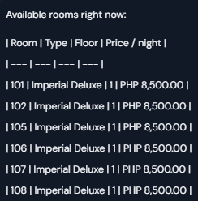

# 🏨 Emperor Hotel Reservation and Management System

A robust, local-first web application designed for guest self-service booking and hotel administrative operations. Built using **Core PHP (OOP)**, **MySQL (PDO)**, and **Bootstrap 5**, the project features real-time database-driven workflows, dynamic reporting, local offline assets, and an intelligent hybrid AI Support Assistant.



---

## 🚀 Key Features

### 💻 Guest Portal & Booking Flow
* **Two-Column Booking Layout**: Side-by-side display of stay details, pricing, and live room availability selection.
* **Live Room Selection**: Room type cards with real-time status badges, capacity descriptors, and visual filters.
* **Dynamic Cost Tracker**: Computes room rate, night counts, subtotal, inclusions, and estimated totals on-the-fly.
* **Simulated Payments**: Custom client checkout paths supporting Cash (generates desk reference) and Card/Online payments.
* **Booking History**: Consolidated timeline tracking guest stay records and verification states.

### 💼 Administrative Management Hub
* **Unified Admin Dashboard**:
  * Real-time KPI summaries (active customers, available rooms, pending reservations, monthly revenue).
  * Interactive data visualization powered by **Chart.js** (Occupancy rates, payment types, reservation statuses).
  * Operational watchlist highlighting overdue check-outs, pending actions, and payment failures.
* **Booking Records Modal Controls**: Clean single-row table controls opening a comprehensive Front Desk action panel (Confirm, Check-In, Extend Stay, Check-Out, Cancel, Receipt generation, Payment collection, Delete).
* **XML Import/Export System**: Room inventory synchronization using native PHP `DOMDocument` XML parsers.
* **Reports Generator**: Date-filtered analytics for occupancy percentage, room-type revenue breakdown, and daily booking trends.

### 🤖 Intelligent AI Support Assistant
* **Local-First Routing Strategy**: Evaluates greetings using word-boundary regex (`\b`) and maps FAQs (Wi-Fi, parking, policies, contacts) using phrase-coverage matching algorithms first.
* **Interactive Booking Guides**: Step-by-step assistant guidance for customers and administrators on room booking and management.
* **Gemini API Integration**: Uses real-time MySQL database context injection for open-ended or conversational fallbacks.
* **Markdown Table Rendering**: An in-widget JS parser that normalizes Windows CRLF endings and translates raw markdown pipe tables into structured, responsive HTML tables.

---

## 🛠️ Technology Stack

* **Language**: PHP 8.x (OOP Paradigm, Models, Controllers, Config structure)
* **Database**: MySQL (PDO interface with prepared statements to prevent SQL Injection)
* **Design & Layout**: Bootstrap 5.3.3 (locally hosted), Bootstrap Icons, custom modular CSS
* **Charts**: Chart.js 4.5.1 (offline browser build)
* **XML Processing**: PHP DOMDocument API
* **AI Engine**: Google Gemini API REST Protocol

---

## 📂 Project Directory Structure

```text
├── app/
│   ├── config/          # Database connection credentials
│   ├── helpers/         # Session management, authentication, flash, money helpers
│   └── models/          # OOP Model classes (User, Guest, Room, Reservation, Payment, SupportAssistant)
├── database/
│   ├── schema.sql       # Database schema & constraints definition
│   └── seed_rooms.sql   # Room inventory seed dataset
├── docs/                # Comprehensive architectural and rubric documentation
└── public/
    ├── admin/           # Administrative panels, reports, dashboard, bookings
    ├── assets/          # CSS, local fonts, JS libraries (Chart.js, Bootstrap)
    ├── auth/            # Login, register, logout handlers
    ├── includes/        # Header, layouts, room catalog datasets
    ├── site/            # Public marketing home and rooms listing
    ├── support/         # AI Support Chat API endpoint
    └── user/            # Customer dashboard and booking portal
```

---

## ⚙️ Quick Installation (XAMPP Environment)

1. **Clone the Repository**:
   Clone this repository into your XAMPP `htdocs` directory:
   ```bash
   cd C:\xampp\htdocs
   git clone https://github.com/WizardOfXerox/Emperor-Hotel.git emperor_hotel
   ```

2. **Configure Database**:
   * Start Apache and MySQL from the XAMPP Control Panel.
   * Go to `http://localhost/phpmyadmin` and create a database named `emperor_hotel`.
   * Import `database/schema.sql` to initialize tables, relationships, and basic seeds.

3. **Set Up Environment Variables**:
   Create a `.env` file in the root directory based on `.env.example`:
   ```ini
   DB_HOST=127.0.0.1
   DB_NAME=emperor_hotel
   DB_USER=root
   DB_PASS=
   GEMINI_API_KEY=your_gemini_api_key_here
   GEMINI_MODEL=gemini-1.5-flash
   ```

4. **Launch Project**:
   Open your browser and navigate to:
   ```text
   http://localhost/emperor_hotel/
   ```

---

## 📖 Available Documentation

Detailed design, schema, and presentations files can be found in the [docs/](file:///c:/Users/XIA/Documents/xampp/htdocs/emperor_hotel/docs) directory:
* [README.md (Docs)](file:///c:/Users/XIA/Documents/xampp/htdocs/emperor_hotel/docs/README.md) — Documentation index.
* [support-ai-integration.md](file:///c:/Users/XIA/Documents/xampp/htdocs/emperor_hotel/docs/support-ai-integration.md) — Details the hybrid AI agent architecture and date-range extraction.
* [code-explanation.md](file:///c:/Users/XIA/Documents/xampp/htdocs/emperor_hotel/docs/code-explanation.md) — Structural walk-through and OOP models breakdown.
* [database-erd.md](file:///c:/Users/XIA/Documents/xampp/htdocs/emperor_hotel/docs/database-erd.md) — Entity Relationship Diagram schema information.
* [rubric-presentation-guide.md](file:///c:/Users/XIA/Documents/xampp/htdocs/emperor_hotel/docs/rubric-presentation-guide.md) — Project requirements and defense scripting.
