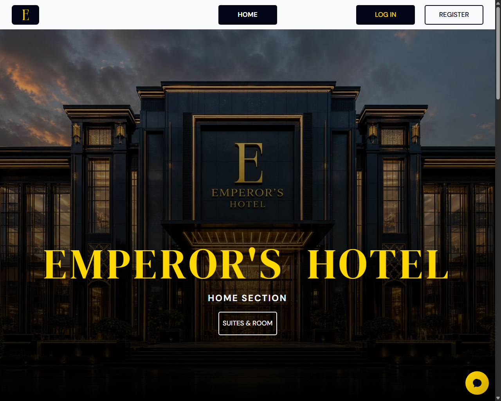

# 🏨 Emperor Hotel Reservation and Management System

A robust, local-first web application designed for guest self-service booking and hotel administrative operations. Built using **Core PHP (OOP)**, **MySQL (PDO)**, and **Bootstrap 5**, the project features real-time database-driven workflows, dynamic reporting, local offline assets, automatic room status reconciliation, and an intelligent hybrid AI Support Assistant.



---

## 🔑 Demo Account Credentials

| Account Role | Email Address | Password | Privileges |
| :--- | :--- | :--- | :--- |
| **System Administrator** | `jayjaypantaleon@gmail.com` | `admin123` *(or `AdminPass123!`)* | Full Admin Dashboard, Room Inventory, Front Desk Actions, Reports, User Management. |
| **Registered Guest** | `maria.santos@gmail.com` | `user123` | Guest Portal, Stay Bookings, Room Inspection, Payment Checkout, Receipt Printing. |

---

## 🚀 Key Features

### 💻 Guest Portal & Booking Flow
* **Dual-Mode SMTP & Offline OTP Verification**: Registration and reservation bookings generate 6-digit OTP verification codes delivered live via Gmail SMTP socket or instantly displayed on-screen during offline localhost presentations.
* **Luxury Contact Us Page**: Interactive concierge inquiry page reading live `.env` support credentials (`SUPPORT_EMAIL`, `SUPPORT_PHONE`, `HOTEL_ADDRESS`) with instant SMTP inquiry dispatch.
* **Dynamic Grid Layout Switcher**: Interactive toolbar on the room catalog enabling **Auto Responsive** layout calculation (`5 Cols` for ultra-wide screens ≥1600px, `4 Cols`, `3 Cols`, `2 Cols`, and `1 Col List View`) with `LocalStorage` persistence.
* **Guest View Housekeeping Rule**: Rooms in internal housekeeping `Cleaning` state are mapped to **`Available`** for online guests so future stay reservations are not blocked, while staff preserve real-time room status tracking on the admin panel.
* **Smart Back to Catalog Anchor Scroll**: `Back to Catalog` links on room detail pages attach `#room-card-ID` anchor hashes, smoothly scrolling back to the exact room card inspected.
* **Two-Column Booking Layout**: Side-by-side display of stay details, pricing, and live room availability selection.
* **Live Room Selection**: Room type cards with real-time status badges, capacity descriptors, and visual filters.
* **Dynamic Cost Tracker**: Computes room rate, night counts, subtotal, inclusions, and estimated totals on-the-fly.
* **Standardized Payment Methods**: Full support for Cash, Credit Card, Debit Card, E-Wallet, Bank Transfer, and Other payment channels.
* **Automatic Online Payment Confirmation**: E-Wallet, Credit Card, Debit Card, and Bank Transfer payments auto-confirm and promote pending bookings to **`Confirmed`** status.
* **Booking History & Self-Service Cancellation**: Consolidated timeline tracking guest stay records, verification states, and cancellation.

### 💼 Administrative Management Hub
* **Guest Messages & Concierge Inbox**: Full-featured inbox (`public/admin/messages.php`) with unread badge indicators, status filters (`Unread`, `Read`, `Replied`), inquiry type filters, message modal, and instant SMTP email reply capabilities.
* **Direct Outbound Guest Email Notifications**: Send direct email notices to guests regarding booking conflicts, payment reminders, suite transfers, or custom messages directly from reservation manage modals or the compose email wizard.
* **Paginated User Management**: Interactive search, role filtering, and dynamic pagination controls on `public/admin/users.php`.
* **Rooms Availability Information**: Renamed interactive 2D floor grid featuring floor tab navigation, real-time status legend badges, and touch-optimized horizontal tab scrolling on mobile viewports.
* **Automatic Room Operational Status Reconciliation**: Built-in engine (`Reservation::syncAllRoomStatuses()`) automatically reconciling room statuses so active bookings (`Pending`, `Confirmed`, `Checked-in`) block rooms from being mistakenly displayed as `Available`.
* **Unified Admin Dashboard & Executive Analytics**:
  * Real-time KPI summaries (active customers, available rooms, pending reservations, monthly revenue).
  * **Advanced Executive Hospitality Metrics**: ALOS (Average Length of Stay), Booking Lead Time, Cancellation Loss Rate ($PHP$), and Repeat Guest Loyalty Ratio.
  * **High-Contrast Canvas Data Label Badges**: Custom Chart.js `emperorValuePlugin` rendering numbers inside rounded pill badges preventing label clipping across dark and light themes.
  * **Horizontal Status Bar Charts**: Clean horizontal bar breakdown replacing cramped status doughnut charts on `dashboard.php` so low counts are fully visible.
  * **Site-Wide Operational Watchlist**: Global front desk alert banner and header notification bell listing overdue check-outs, overbooking conflicts, and failed payments across ALL admin pages.
* **Instant Quick Select Room & URL Auto-Selection**: Top dropdown selector on `create-reservation.php` with 2-way JavaScript synchronization and automatic URL `?room_id=` room card targeting.
* **Refund Validation & Payment Cancellation Sync**: Hard refund guard preventing unconfirmed cash refunds, alongside automated payment status updates (`Pending` ➔ `Failed`, `Confirmed` ➔ `Refunded`) upon reservation cancellation.
* **Occupied Room Safety Rules**: Strict validation blocking room deletion or `Maintenance` status assignment while a guest is actively `Checked-in`.
* **Simplified Suite Pricing Management**: Clean 2-field Suite Pricing card (`Select Suite / Floor` + `Price / Night (PHP)`) with dynamic baseline price reset (`rooms.base_price_per_night`).
* **Floor-Based Room Number Range Validation**: Enforces strict floor-based room number limits ($N00$ to $N99$ for Floor $N$) with real-time UI hints and duplicate check.
* **Luxury Glassmorphism Modal System**: Cohesive obsidian-gold glassmorphism modal popup theme (`#0B1120` to `#0F172A`) with gold focus glow and serif titles across all admin action dialogues.
* **Mobile Viewport Optimization**: 100% touch-friendly responsive layout and modal container formatting verified via automated Playwright tests on iPhone 13 (`390x844`) screens.
* **Booking Records Manage Modal & Refund Workflow**: Clean single-row table controls opening a comprehensive Front Desk action panel (Confirm, Check-In, Extend Stay, Check-Out, Process Refund, Cancel, Receipt generation, Payment collection, Delete).
* **Process Refund & Financial Ledger**: Built-in refund entry workflow updating remaining balances while preserving immutable payment audit log records.
* **XML Import/Export System**: Room inventory synchronization using native PHP `DOMDocument` XML parsers with automatic validation fallback.
* **Reports Generator with Visual Graph Toggles**: Date-filtered analytics for occupancy percentage, room-type revenue breakdown, payment method shares, and daily booking trends with interactive `[Graph]` / `[Table]` view toggles.

### 🤖 Intelligent Hybrid AI Support Assistant
* **Local-First Routing Strategy**: Evaluates greetings using word-boundary regex (`\b`) and maps FAQs (Wi-Fi, parking, policies, contacts) using phrase-coverage matching algorithms first.
* **Interactive Booking Guides**: Step-by-step assistant guidance for customers and administrators on room booking and management.
* **Gemini 2.5 Flash API Integration**: Uses real-time MySQL database context injection (room rankings, revenue, RevPAR, availability) for open-ended or conversational fallbacks via Google's `gemini-2.5-flash` model.
* **Markdown Table Rendering**: An in-widget JS parser that normalizes Windows CRLF endings and translates raw markdown pipe tables into structured, responsive HTML tables.

---

## 🛠️ Technology Stack

* **Language**: PHP 8.x (OOP Paradigm, Models, Controllers, Config structure)
* **Database**: MySQL (PDO interface with prepared statements to prevent SQL Injection)
* **Design & Layout**: Bootstrap 5.3.3 (locally hosted), Bootstrap Icons, custom modular CSS
* **Charts**: Chart.js 4.5.1 (offline browser build)
* **XML Processing**: PHP DOMDocument API
* **Automated Testing**: Playwright E2E Suite (Node.js)
* **AI Engine**: Google Gemini API REST Protocol (`gemini-2.5-flash`)

---

## 📂 Project Directory Structure

```text
├── app/
│   ├── config/          # Database connection credentials & hotel profile
│   ├── helpers/         # Session management, authentication, flash, money helpers
│   └── models/          # OOP Model classes (User, Guest, Room, Reservation, Payment, SupportAssistant)
├── database/
│   ├── schema.sql       # Database schema & constraints definition
│   ├── seed_large_dataset.php # PHP Seeder script for 210+ realistic reservations
│   ├── seed_large_dataset.sql # Generated SQL seed dump
│   └── dump_seed.php    # SQL exporter utility
├── docs/                # Comprehensive architectural and rubric documentation
│   └── test_cases_major_features.md # 30-Step Connected Narrative E2E Test Suite
├── public/
│   ├── admin/           # Administrative panels, reports, dashboard, bookings, rooms
│   ├── assets/          # CSS, local fonts, JS libraries (Chart.js, Bootstrap, support widget)
│   ├── auth/            # Login, register, 2FA OTP, forgot password handlers
│   ├── includes/        # Header, layouts, room catalog, 2D floor map
│   ├── site/            # Public marketing home, rooms showcase, suites, contact
│   ├── support/         # AI Support Chat API endpoint
│   └── user/            # Customer dashboard and booking portal
```

---

## ⚙️ Quick Installation (XAMPP Environment)

1. **Clone the Repository**:
   Clone this repository into your XAMPP `htdocs` directory:
   ```bash
   cd C:\xampp\htdocs
   git clone https://github.com/WizardOfXerox/Emperor-Hotel.git emperor_hotel
   ```

2. **Configure Database**:
   * Start Apache and MySQL from the XAMPP Control Panel.
   * Go to `http://localhost/phpmyadmin` and create a database named `emperors_hotel_db`.
   * Import `database/seed_large_dataset.sql` (or run `php database/seed_large_dataset.php`) to initialize tables and load 210+ sample reservations.

3. **Set Up Environment Variables**:
   Create a `.env` file in the root directory:
   ```ini
   DB_HOST=127.0.0.1
   DB_NAME=emperors_hotel_db
   DB_USER=root
   DB_PASS=
   GEMINI_API_KEY=your_gemini_api_key_here
   GEMINI_MODEL=gemini-2.5-flash
   ```

4. **Launch Project**:
   Open your browser and navigate to:
   ```text
   http://localhost/emperor_hotel/
   ```

---

## 📖 Available Documentation

Detailed design, schema, and presentations files can be found in the [docs/](file:///c:/Users/XIA/Documents/xampp/htdocs/emperor_hotel/docs) directory:
* [README.md (Docs)](file:///c:/Users/XIA/Documents/xampp/htdocs/emperor_hotel/docs/README.md) — Documentation index.
* [test_cases_major_features.md](file:///c:/Users/XIA/Documents/xampp/htdocs/emperor_hotel/docs/test_cases_major_features.md) — 30-Step Connected Narrative E2E Test Suite.
* [support-ai-integration.md](file:///c:/Users/XIA/Documents/xampp/htdocs/emperor_hotel/docs/support-ai-integration.md) — Details the hybrid AI agent architecture and date-range extraction.
* [code-explanation.md](file:///c:/Users/XIA/Documents/xampp/htdocs/emperor_hotel/docs/code-explanation.md) — Structural walk-through and OOP models breakdown.
* [database-erd.md](file:///c:/Users/XIA/Documents/xampp/htdocs/emperor_hotel/docs/database-erd.md) — Entity Relationship Diagram schema information.
* [rubric-presentation-guide.md](file:///c:/Users/XIA/Documents/xampp/htdocs/emperor_hotel/docs/rubric-presentation-guide.md) — Project requirements and defense scripting.
* [sql-query-explanation.md](file:///c:/Users/XIA/Documents/xampp/htdocs/emperor_hotel/docs/sql-query-explanation.md) — Explains the SQL queries inside every model class.
