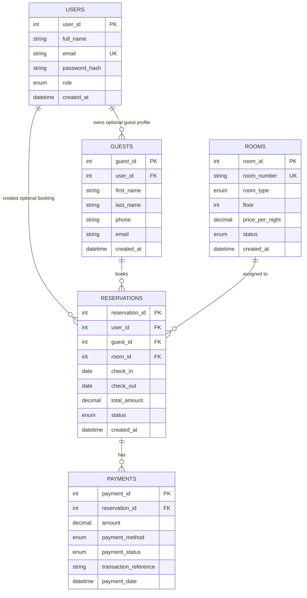

# Database ERD

Main database name: `emperors_hotel_db`

Main SQL files:

- `database/schema.sql`: creates the database, creates all tables, and inserts the initial 36 room records.
- `database/seed_rooms.sql`: updates/seeds room inventory for an existing database without dropping tables.

Related documentation:

- `docs/erd-file-correlation.md`: maps each ERD table to the PHP models, pages, includes, and UI files that use it.

## ERD Diagram



## Table Summary

### users

Purpose:
Stores login accounts and role-based access.

Important fields:

- `user_id`: primary key
- `email`: unique login identifier
- `password_hash`: hashed password from `password_hash()`
- `role`: `admin` or `user`

Relationships:

- One user can own many guest profiles.
- One user can create many reservations.
- `reservations.user_id` and `guests.user_id` are nullable so walk-in or admin-created records can exist without a user account.

### guests

Purpose:
Stores guest names and contact details used in reservations.

Important fields:

- `guest_id`: primary key
- `user_id`: optional link to a registered user
- `first_name`, `last_name`, `phone`, `email`: guest contact details

Relationships:

- One guest can have many reservations.
- If a user is deleted, `user_id` is set to null instead of deleting the guest.

### rooms

Purpose:
Stores room inventory, room type, floor, dynamic nightly price, and operational status.

Important fields:

- `room_id`: primary key
- `room_number`: unique visible room number
- `room_type`: allowed values are `Imperial Deluxe`, `Royal Executive`, `Emperor Presidential`
- `price_per_night`: editable nightly room price used by booking calculations
- `status`: allowed values are `Available`, `Reserved`, `Occupied`

Seeded inventory:

- 12 Imperial Deluxe rooms: 101 to 112
- 12 Royal Executive rooms: 201 to 212
- 12 Emperor Presidential rooms: 301 to 312

Default seed prices:

- Imperial Deluxe: PHP 4,500.00
- Royal Executive: PHP 7,500.00
- Emperor Presidential: PHP 12,500.00

Note:
Prices are stored in the database. The admin Rooms page can bulk update the price for all rooms under a selected room type.

### Room type inclusions

Room inclusions are intentionally not stored in a separate table. They are simple PHP catalog text in `public/includes/room_catalog.php`, which keeps the student project easier to explain.

Default room-type inclusions:

- Imperial Deluxe: Complimentary breakfast set
- Royal Executive: Breakfast buffet plus priority Wi-Fi
- Emperor Presidential: Breakfast buffet, car shuttle, and late checkout

These inclusions are descriptive only. Reservation totals are calculated from the room price and number of nights.

### reservations

Purpose:
Stores booking records and connects users/guests/rooms.

Important fields:

- `reservation_id`: primary key
- `user_id`: optional user who created the reservation
- `guest_id`: required guest
- `room_id`: required assigned room
- `check_in`, `check_out`: booking dates
- `total_amount`: booking total
- `status`: allowed values are `Pending`, `Confirmed`, `Checked-in`, `Checked-out`, `Cancelled`

Relationships:

- Deleting a guest cascades to related reservations.
- Deleting a room is restricted if reservations depend on it.
- Reservation status changes and deletes recalculate the room status from remaining active reservations in the PHP model.

### payments

Purpose:
Stores payment records connected to reservations.

Important fields:

- `payment_id`: primary key
- `reservation_id`: required reservation
- `amount`: payment amount
- `payment_method`: `Cash`, `Credit Card`, `Debit Card`, `Bank Transfer`, `Online Payment`, or `Other`
- `payment_status`: `Pending`, `Confirmed`, `Failed`, or `Refunded`
- `transaction_reference`: system-generated payment reference, using `PAY-` for manual payments and `SIM-` for simulated transactions

Relationships:

- One reservation can have many payments.
- Deleting a reservation cascades to related payments.

Application rule:

- Pending and confirmed payment amounts are checked by the PHP `Payment` model so their active total cannot exceed the reservation total.
- Fully paid pending reservations are automatically promoted to `Confirmed` after confirmed payments cover the reservation total.

## Relationship Rules

- `users.user_id` to `guests.user_id`: one-to-many, nullable, delete user sets guest user_id to null.
- `users.user_id` to `reservations.user_id`: one-to-many, nullable, delete user sets reservation user_id to null.
- `guests.guest_id` to `reservations.guest_id`: one-to-many, delete guest cascades reservations.
- `rooms.room_id` to `reservations.room_id`: one-to-many, delete room is restricted.
- `reservations.reservation_id` to `payments.reservation_id`: one-to-many, delete reservation cascades payments.

## Dashboard Data Sources

- User count comes from `users`.
- Customers this month and pending/upcoming reservations come from `reservations`.
- Monthly bookings and confirmed revenue use `reservations` joined to confirmed `payments`.
- Room status chart uses grouped `rooms.status`.
- Reservation status chart uses grouped `reservations.status`.
- Payment status chart uses grouped `payments.payment_status`.
- Dashboard operational alerts use `reservations`, `rooms`, and `payments`.
- Admin Reports use `reservations` for occupancy and reservation trend data, `payments` for confirmed revenue, and `rooms` for room type grouping.

## Room XML + DOM Data Shape

Room XML export/import is handled by `app/models/Room.php`.

XML support is only implemented for room records. Users, guests, reservations, and payments are managed through the PHP pages and MySQL tables, not XML files.

Expected structure:

```xml
<rooms>
  <room>
    <room_number>101</room_number>
    <room_type>Imperial Deluxe</room_type>
    <floor>1</floor>
    <price_per_night>4500.00</price_per_night>
    <status>Available</status>
  </room>
</rooms>
```

## Import Order

For a fresh database:

1. Import `database/schema.sql`.

For an existing database that already has the tables:

1. Import `database/seed_rooms.sql` to normalize the three room types and seed/update the 36 room records.

## ERD To File Correlation

Use `docs/erd-file-correlation.md` when you need to trace a table to the exact PHP model, admin page, customer page, shared include, or UI file that uses it.

Quick ownership guide:

| Table | Main model | Main pages |
| --- | --- | --- |
| `users` | `app/models/User.php` | `public/auth/login.php`, `public/auth/register.php`, `public/admin/users.php` |
| `guests` | `app/models/Guest.php` | `public/admin/guests.php`, `public/admin/reservations.php`, `public/user/dashboard.php` |
| `rooms` | `app/models/Room.php` | `public/admin/rooms.php`, `public/site/home.php`, `public/site/rooms.php`, reservation forms |
| `reservations` | `app/models/Reservation.php` | `public/admin/reservations.php`, `public/admin/booking-records.php`, `public/user/dashboard.php`, availability endpoints, receipts |
| `payments` | `app/models/Payment.php` | `public/admin/payments.php`, `public/user/payment.php`, `public/admin/receipt.php`, dashboard |
