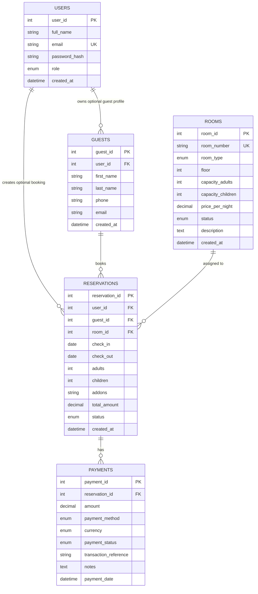

# Database Usage

Main database name: `emperors_hotel_db`

Main SQL file: `database/schema.sql`

Seed/update file for existing databases: `database/seed_rooms.sql`

## Database Purpose

The database stores the core hotel reservation records:

- User accounts
- Guest contact details
- Room inventory
- Reservation records
- Payment records

## Create Database

```sql
CREATE DATABASE IF NOT EXISTS emperors_hotel_db;
USE emperors_hotel_db;
```

## Create Tables

The full table definitions are in `database/schema.sql`. The system currently uses five main tables.

### users

```sql
CREATE TABLE users (
    user_id INT AUTO_INCREMENT PRIMARY KEY,
    full_name VARCHAR(150) NOT NULL,
    email VARCHAR(150) NOT NULL UNIQUE,
    password_hash VARCHAR(255) NOT NULL,
    role ENUM('admin', 'user') NOT NULL DEFAULT 'user',
    created_at TIMESTAMP DEFAULT CURRENT_TIMESTAMP
);
```

### guests

```sql
CREATE TABLE guests (
    guest_id INT AUTO_INCREMENT PRIMARY KEY,
    user_id INT NULL,
    first_name VARCHAR(100) NOT NULL,
    last_name VARCHAR(100) NOT NULL,
    phone VARCHAR(30) DEFAULT NULL,
    email VARCHAR(150) DEFAULT NULL,
    created_at TIMESTAMP DEFAULT CURRENT_TIMESTAMP,
    FOREIGN KEY (user_id) REFERENCES users(user_id) ON DELETE SET NULL
);
```

### rooms

```sql
CREATE TABLE rooms (
    room_id INT AUTO_INCREMENT PRIMARY KEY,
    room_number VARCHAR(10) NOT NULL UNIQUE,
    room_type ENUM('Imperial Deluxe', 'Royal Executive', 'Emperor Presidential') NOT NULL,
    floor INT NOT NULL,
    capacity_adults INT NOT NULL DEFAULT 2,
    capacity_children INT NOT NULL DEFAULT 1,
    price_per_night DECIMAL(10,2) NOT NULL,
    status ENUM('Available', 'Reserved', 'Occupied', 'Cleaning', 'Maintenance') NOT NULL DEFAULT 'Available',
    description TEXT,
    created_at TIMESTAMP DEFAULT CURRENT_TIMESTAMP
);
```

### reservations

```sql
CREATE TABLE reservations (
    reservation_id INT AUTO_INCREMENT PRIMARY KEY,
    user_id INT NULL,
    guest_id INT NOT NULL,
    room_id INT NOT NULL,
    check_in DATE NOT NULL,
    check_out DATE NOT NULL,
    adults INT NOT NULL DEFAULT 1,
    children INT NOT NULL DEFAULT 0,
    addons VARCHAR(255) DEFAULT NULL,
    total_amount DECIMAL(10,2) NOT NULL DEFAULT 0.00,
    status ENUM('Pending', 'Confirmed', 'Checked-in', 'Checked-out', 'Cancelled') NOT NULL DEFAULT 'Pending',
    created_at TIMESTAMP DEFAULT CURRENT_TIMESTAMP,
    FOREIGN KEY (user_id) REFERENCES users(user_id) ON DELETE SET NULL,
    FOREIGN KEY (guest_id) REFERENCES guests(guest_id) ON DELETE CASCADE,
    FOREIGN KEY (room_id) REFERENCES rooms(room_id) ON DELETE RESTRICT
);
```

### payments

```sql
CREATE TABLE payments (
    payment_id INT AUTO_INCREMENT PRIMARY KEY,
    reservation_id INT NOT NULL,
    amount DECIMAL(10,2) NOT NULL,
    payment_method ENUM('Cash', 'Credit Card', 'Debit Card', 'Bank Transfer', 'Other') NOT NULL DEFAULT 'Cash',
    currency ENUM('PHP', 'USD', 'EUR') NOT NULL DEFAULT 'PHP',
    payment_status ENUM('Pending', 'Confirmed', 'Failed', 'Refunded') NOT NULL DEFAULT 'Pending',
    transaction_reference VARCHAR(100) DEFAULT NULL,
    notes TEXT,
    payment_date TIMESTAMP DEFAULT CURRENT_TIMESTAMP,
    FOREIGN KEY (reservation_id) REFERENCES reservations(reservation_id) ON DELETE CASCADE
);
```

## Insert Data

Example user insert:

```sql
INSERT INTO users (full_name, email, password_hash, role)
VALUES ('Admin User', 'admin@example.com', '$2y$10$examplehashedpassword', 'admin');
```

Example room insert:

```sql
INSERT INTO rooms (
    room_number,
    room_type,
    floor,
    capacity_adults,
    capacity_children,
    price_per_night,
    status,
    description
) VALUES (
    '101',
    'Imperial Deluxe',
    1,
    2,
    1,
    4500.00,
    'Available',
    'A polished deluxe room with a warm luxury feel.'
);
```

Example reservation insert:

```sql
INSERT INTO reservations (
    user_id,
    guest_id,
    room_id,
    check_in,
    check_out,
    adults,
    children,
    addons,
    total_amount,
    status
) VALUES (
    1,
    1,
    1,
    '2026-06-01',
    '2026-06-03',
    2,
    0,
    'Breakfast',
    9000.00,
    'Pending'
);
```

## Update Data

Example room price update:

```sql
UPDATE rooms
SET price_per_night = 5000.00
WHERE room_type = 'Imperial Deluxe';
```

Example reservation status update:

```sql
UPDATE reservations
SET status = 'Confirmed'
WHERE reservation_id = 1;
```

Example user role update:

```sql
UPDATE users
SET role = 'admin'
WHERE user_id = 1;
```

## Delete Data

Example delete payment:

```sql
DELETE FROM payments
WHERE payment_id = 1;
```

Example delete user:

```sql
DELETE FROM users
WHERE user_id = 5;
```

Important relationship behavior:

- Deleting a user sets related guest/reservation `user_id` values to `NULL`.
- Deleting a guest deletes related reservations.
- Deleting a reservation deletes related payments.
- Deleting a room is restricted if reservations depend on that room.

## Query Data

Example list all rooms:

```sql
SELECT room_id, room_number, room_type, price_per_night, status
FROM rooms
ORDER BY floor, room_number;
```

Example available rooms:

```sql
SELECT room_number, room_type, price_per_night
FROM rooms
WHERE status = 'Available'
ORDER BY room_type, room_number;
```

Example reservations with guest and room details:

```sql
SELECT
    reservations.reservation_id,
    guests.first_name,
    guests.last_name,
    rooms.room_number,
    rooms.room_type,
    reservations.check_in,
    reservations.check_out,
    reservations.total_amount,
    reservations.status
FROM reservations
JOIN guests ON guests.guest_id = reservations.guest_id
JOIN rooms ON rooms.room_id = reservations.room_id
ORDER BY reservations.created_at DESC;
```

Example confirmed revenue:

```sql
SELECT SUM(amount) AS confirmed_revenue
FROM payments
WHERE payment_status = 'Confirmed';
```

Example room status summary:

```sql
SELECT status, COUNT(*) AS total
FROM rooms
GROUP BY status;
```

## ERD Model



## Table Relationships

| Relationship | Type | Meaning |
| --- | --- | --- |
| `users.user_id` to `guests.user_id` | One-to-many | One user can have an optional guest profile. |
| `users.user_id` to `reservations.user_id` | One-to-many | One user can create many reservations. |
| `guests.guest_id` to `reservations.guest_id` | One-to-many | One guest can have many reservations. |
| `rooms.room_id` to `reservations.room_id` | One-to-many | One room can be assigned to many reservations over time. |
| `reservations.reservation_id` to `payments.reservation_id` | One-to-many | One reservation can have many payment records. |

## Room Seed Data

The project seeds 36 rooms:

| Room Type | Room Numbers | Default Price |
| --- | --- | --- |
| Imperial Deluxe | 101 to 112 | PHP 4,500.00 |
| Royal Executive | 201 to 212 | PHP 7,500.00 |
| Emperor Presidential | 301 to 312 | PHP 12,500.00 |

Room prices are stored in `rooms.price_per_night`, so prices can be updated in the database instead of hardcoded in the public pages.
