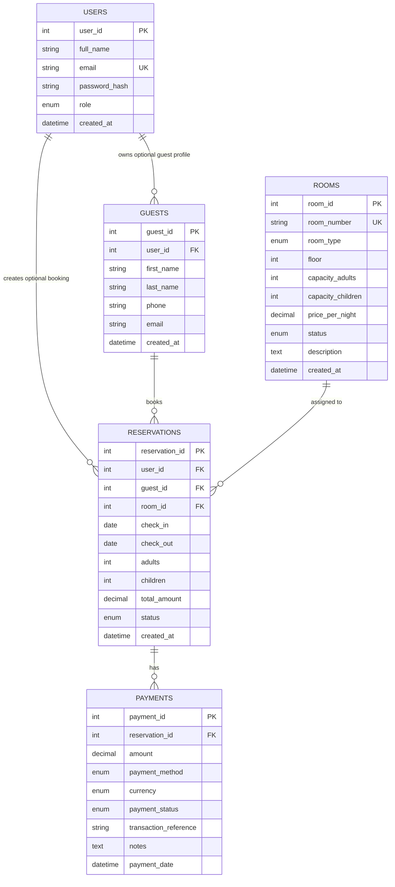
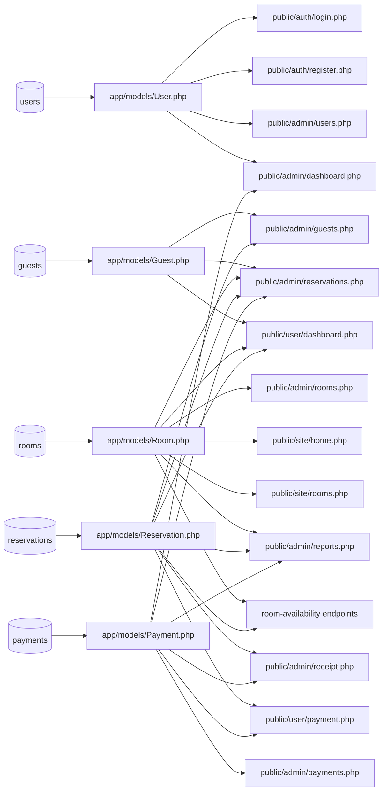

# ERD File Correlation

This document connects the database ERD tables to the PHP files that read, write, display, or validate those records.

Main ERD source: `database/schema.sql`

Main rule: database SQL should stay inside `app/models/*.php` as much as possible. PHP pages should create model objects, process forms, and render UI.

## ERD Diagram

## Table To File Map

| ERD Table | Primary Model | Main PHP Files | Main Responsibility |
| --- | --- | --- | --- |
| `users` | `app/models/User.php` | `public/auth/login.php`, `public/auth/register.php`, `public/admin/users.php`, `public/admin/dashboard.php` | Login, registration, admin user CRUD, dashboard user counts. |
| `guests` | `app/models/Guest.php` | `public/admin/guests.php`, `public/admin/reservations.php`, `public/user/dashboard.php` | Guest records, walk-in guest search, guest history, reservation guest details. |
| `rooms` | `app/models/Room.php` | `public/admin/rooms.php`, `public/admin/reservations.php`, `public/user/dashboard.php`, `public/site/home.php`, `public/site/rooms.php`, `public/admin/dashboard.php`, `public/admin/reports.php` | Room inventory, room status, price per night, room XML import/export, public room prices, dashboard room status, report grouping. |
| `reservations` | `app/models/Reservation.php` | `public/admin/reservations.php`, `public/user/dashboard.php`, `public/admin/dashboard.php`, `public/admin/guests.php`, `public/admin/receipt.php`, `public/user/payment.php`, `public/admin/reports.php`, `public/admin/room-availability.php`, `public/user/room-availability.php` | Booking records, date validation, date-aware room availability, manual room selection, status flow, check-in/check-out, dashboard alerts, reports. |
| `payments` | `app/models/Payment.php` | `public/admin/payments.php`, `public/user/payment.php`, `public/admin/reservations.php`, `public/admin/receipt.php`, `public/admin/dashboard.php`, `public/admin/reports.php` | Payment logs, generated references, automatic pending cash payment references, simulated payments, payment review, balances, dashboard revenue, revenue reports. |

## File To ERD Table Map

| PHP File | Related ERD Tables | Read/Write | Notes |
| --- | --- | --- | --- |
| `public/auth/login.php` | `users` | Read | Authenticates by email and password through `User.php`. |
| `public/auth/register.php` | `users` | Write | Creates a normal user account through `User.php`. |
| `public/auth/logout.php` | None directly | Session only | Ends the PHP session; it does not touch database tables directly. |
| `public/site/home.php` | `rooms` | Read | Shows public room cards, static room-type inclusions, and starting prices. |
| `public/site/rooms.php` | `rooms` | Read | Shows room details, static room-type inclusions, prices, and carousel images. |
| `public/user/dashboard.php` | `users`, `guests`, `rooms`, `reservations`, `payments` | Read/write | Lets logged-in users create reservations through the two-column booking form, pick room cards, view booking history, choose payment route, and generate automatic pending cash payment references. |
| `public/user/payment.php` | `reservations`, `payments` | Read/write | Lets customers submit simulated non-cash payments for their own reservations. |
| `public/user/room-availability.php` | `rooms`, `reservations` | Read | Returns date-aware room availability JSON for the user booking form. |
| `public/admin/dashboard.php` | `users`, `rooms`, `reservations`, `payments` | Read | Shows KPI cards, recent reservations, payment activity, and Chart.js reports. |
| `public/admin/rooms.php` | `rooms` | Read/write | Handles room CRUD, bulk price updates, and room XML import/export. |
| `public/admin/reservations.php` | `guests`, `rooms`, `reservations`, `payments` | Read/write | Handles walk-in reservation creation, edits, deletes, date availability, same-room stay extension, modal-based front desk action controls, payment summaries, and automatic pending cash payment references. |
| `public/admin/payments.php` | `reservations`, `payments` | Read/write | Records manual payments, simulated transactions, generated references, and admin payment status review. |
| `public/admin/guests.php` | `guests`, `reservations`, `payments`, `rooms` | Read | Searches guests and shows reservation/payment history. |
| `public/admin/receipt.php` | `reservations`, `payments`, `guests`, `rooms` | Read | Shows printable receipt details and transaction history. |
| `public/admin/reports.php` | `rooms`, `reservations`, `payments` | Read | Shows date-filtered occupancy, confirmed revenue, and reservation trend reports. |
| `public/admin/users.php` | `users` | Read/write | Handles admin user CRUD. |
| `public/admin/room-availability.php` | `rooms`, `reservations` | Read | Returns date-aware room availability JSON for the admin reservation form. |

## Shared Include Correlation

| Shared File | Related ERD Tables | Responsibility |
| --- | --- | --- |
| `app/config/database.php` | All tables | Creates the PDO connection used by model classes. |
| `app/helpers/auth.php` | `users` indirectly | Handles sessions, role checks, redirects, flash messages, escaping, and money formatting. |
| `public/includes/bootstrap.php` | All tables indirectly | Loads the database config, auth helper, and model classes before pages run. |
| `public/includes/layout.php` | None directly | Renders shared HTML head, navigation, admin shell, and page-specific CSS links. |
| `public/includes/room_catalog.php` | `rooms` indirectly | Prepares public room type metadata and static room inclusions. |
| `public/includes/room_selection.php` | `rooms`, `reservations` indirectly | Renders room cards with room-number badges, room inclusions, cost tracker, and date-aware availability JavaScript. |
| `public/includes/room_availability_api.php` | `rooms`, `reservations` | Central JSON helper used by admin and user room availability endpoints. |

## File Correlation Diagram

## Data Ownership Notes

| Area | Ownership Rule |
| --- | --- |
| Account data | `User.php` owns account CRUD and login checks. Pages should not compare password hashes directly. |
| Guest data | `Guest.php` owns guest lookup, upsert, and guest history queries. |
| Room data | `Room.php` owns room CRUD, status summaries, type summaries, bulk price updates, and room XML import/export. |
| Room inclusion text | `public/includes/room_catalog.php` owns simple room-type inclusions used by public pages and reservation forms. |
| Reservation data | `Reservation.php` owns date validation, overlap checks, manual room selection validation, reservation CRUD, status changes, room status syncing, dashboard alerts, and occupancy/trend reports. |
| Payment data | `Payment.php` owns generated references, payment totals, overpayment rules, payment status updates, failed-payment alerts, revenue summaries, and revenue reports. |
| Styling | CSS files do not own data. `app.css` holds shared styling, while page-specific CSS files stay beside their page group under `public/assets/css/`. |
