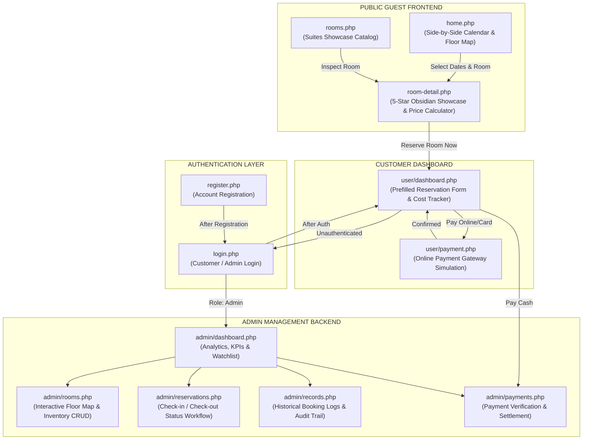
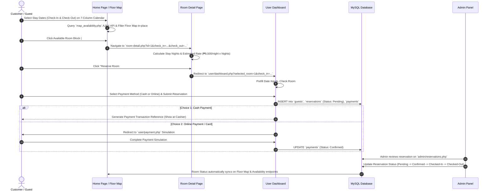
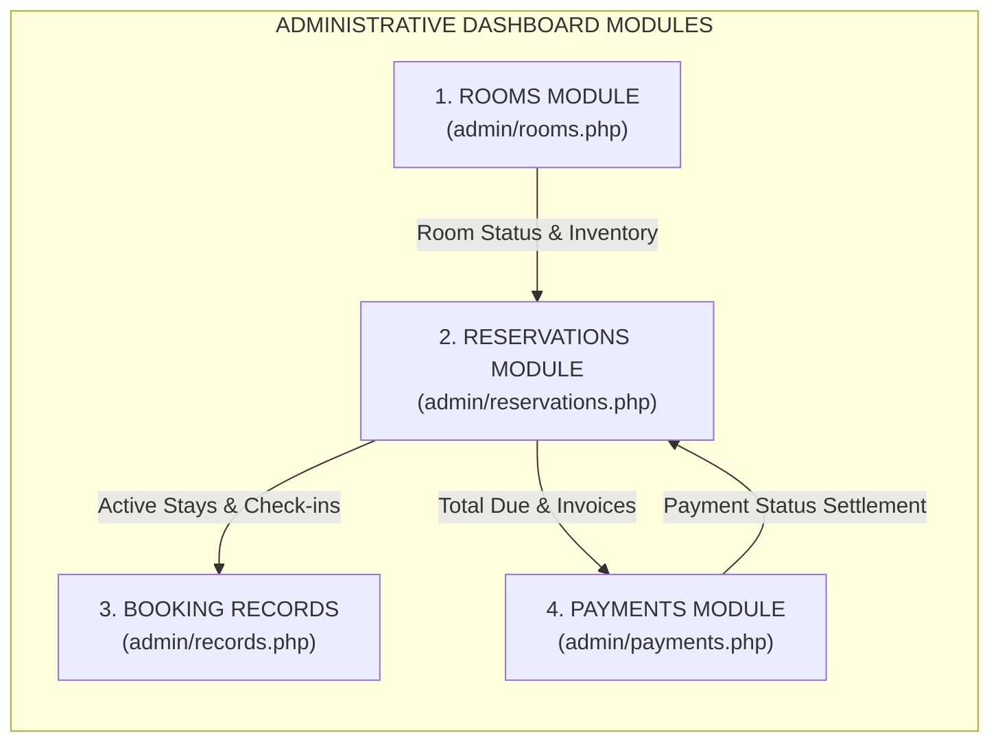
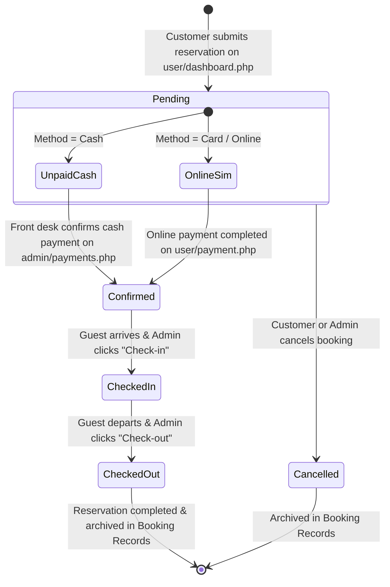

# 🏰 EMPEROR HOTEL RESERVATION SYSTEM - END-TO-END PROCESS FLOW ARCHITECTURE

This document outlines the complete process flow and data lifecycle of the **Emperor Hotel Reservation System**, detailing how guest interactions on the public site transition into reservations, cost calculations, payment routing, and administrative management across Rooms, Reservations, Booking Records, and Payments.

---

## 📐 1. High-Level System Architecture & Page Flow

---

## 🔄 2. Customer Booking & Payment Process Lifecycle

---

## 🛡️ 3. Administrative Operational Data Flow

Below is the detailed breakdown of how data flows across the **4 Core Admin Dashboards**:

### 1. 🚪 Rooms Management Module (`admin/rooms.php`)
- **Primary Function**: Manages the physical hotel inventory and 2D spatial arrangement across floors.
- **Data Flow**:
  1. Displays the **Interactive 2D Hotel Floor Map** for real-time visual inspection (Floor 1: #101–#112, Floor 2: #201–#212, Floor 3: #301–#312).
  2. Clicking any room card opens the **Admin Room Status Modal** allowing status updates (`Available`, `Reserved`, `Occupied`, `Cleaning`, `Maintenance`).
  3. Allows adding new room records, updating room types or rates, filtering inventory, and exporting XML data (`rooms-export.xml`).
  4. Changes immediately update room availability across the public Floor Map and customer booking engine.

### 2. 📅 Reservations Module (`admin/reservations.php`)
- **Primary Function**: Handles guest booking lifecycles, arrival check-ins, and departure check-outs.
- **Data Flow**:
  1. Receives incoming guest reservations created from `user/dashboard.php`.
  2. Administrators review booking details (Check-in/out dates, guest contact info, assigned room, total amount).
  3. **Status Workflow Transition**:
     $$\text{Pending} \longrightarrow \text{Confirmed} \longrightarrow \text{Checked-in} \longrightarrow \text{Checked-out}$$
  4. Marking a reservation as **Checked-in** automatically marks the room as `Occupied` on the Floor Map.
  5. Marking a reservation as **Checked-out** marks the room as `Cleaning` / `Available` for future dates.

### 3. 📜 Booking Records Module (`admin/records.php`)
- **Primary Function**: Audit trail and historical ledger of all past, present, and cancelled bookings.
- **Data Flow**:
  1. Archival repository for completed (`Checked-out`) and `Cancelled` reservations.
  2. Enables filtering by guest name, date ranges, room types, or status.
  3. Provides analytics input for monthly performance revenue metrics and peak booking reports.

### 4. 💳 Payments Module (`admin/payments.php`)
- **Primary Function**: Financial accounting, cashier cash confirmation, and transaction settlement.
- **Data Flow**:
  1. Generates unique transaction references (`EMP-PAY-XXXXX`) for every reservation.
  2. For **Cash Payments**: Front desk cashiers look up payment references when guests pay at the front desk and update payment status to `Confirmed`.
  3. For **Online Payments**: Simulated card/online payments automatically update payment status to `Confirmed`.
  4. Updates the guest's balance due on their User Dashboard from `Balance: PHP X,XXX` to `Paid`.

---

## 🔄 4. Reservation & Payment State Machine

