# Project Explanation Guide

This guide explains how the Emperor Hotel Reservation and Management System works from the point of view of a student presenting an OOP PHP project. It is written to help you answer questions such as:

- What is the purpose of the system?
- Where is OOP used?
- How does a reservation move through the system?
- How does the system prevent unavailable rooms from being booked?
- How do payments, receipts, reports, and the admin dashboard work?
- Which files are responsible for each feature?

## 1. Simple Project Summary

The Emperor Hotel Reservation and Management System is a web-based hotel reservation and front desk management system. It is built with Core PHP, MySQL, PDO, OOP model classes, Bootstrap, Chart.js, and room XML/DOMDocument support.

The system supports two main roles:

| Role | What They Can Do |
| --- | --- |
| Guest visitor | View the homepage and room information before logging in. |
| Registered user | Create reservations from a two-column booking form, choose room dates, choose room cards, review room inclusions, select payment mode, submit simulated non-cash payments, and view booking history below the form. |
| Admin | Manage rooms, reservations, payments, guests, reports, users, receipts, and dashboard monitoring. |

The project is not a Laravel or framework project. It is intentionally built with Core PHP so the OOP structure is easier to see.

## 2. Main Purpose Of The System

The system is designed for a small hotel that needs a local reservation and front desk management tool.

It can:

- Show public hotel pages including a luxury 5-Star Contact Us page (`contact.php`) with concierge email dispatch.
- Register and log in users with 6-digit SMTP OTP email verification (`verify-otp.php`).
- Support Dual-Mode SMTP socket delivery (real Gmail SMTP socket online or instant on-screen OTP fallback offline for 100% reliable localhost presentation).
- Separate admin and user access.
- Let users reserve rooms with real-time OTP confirmation emails.
- Let admins create walk-in reservations with floor-based room number range limits ($N00$ to $N99$ for Floor $N$).
- Simplify Suite Pricing management with clean 2-field Suite Pricing cards and dynamic baseline rate reset (`rooms.base_price_per_night`).
- Track room availability by date.
- Prevent overlapping active reservations for the same room.
- Require users and admins to manually choose an available room card.
- Track room prices from the database and room inclusions from PHP catalog helpers.
- Record manual and simulated payments.
- Generate transaction references automatically.
- Prevent pending and confirmed payments from exceeding the reservation total.
- Print reservation receipts and process front-desk refunds with immutable transaction audit logs.
- Search guest history.
- Show executive dashboard charts, visual demand curves, and 4 advanced hospitality metrics: ALOS (Average Length of Stay), Booking Lead Time (days), Cancellation Loss Rate ($PHP$), and Repeat Guest Loyalty Ratio (%).
- Render all admin popups and modals in a luxury obsidian-gold glassmorphism theme (`#0B1120` to `#0F172A`).
- Import and export room records through XML. XML is only used for room records, not every database table.
- Provide an AI support chat that answers customer and admin questions from live hotel data first, then uses Gemini when the request is conversational or outside the local dataset rules.

It does not process real online payments yet. Online/card/bank payment modes are simulated for demonstration.

## 3. Technology Stack

| Layer | Technology | Why It Is Used |
| --- | --- | --- |
| Backend | Core PHP | Handles page rendering, form submission, validation, sessions, and model calls. |
| OOP | PHP classes | Organizes database and business logic by feature area. |
| Database | MySQL or MariaDB | Stores users, guests, rooms, reservations, and payments. |
| Database access | PDO | Allows prepared statements for safer SQL queries. |
| Authentication | PHP sessions | Stores logged-in user information during browsing. |
| Password security | `password_hash()` and `password_verify()` | Stores passwords securely instead of plain text. |
| Frontend layout | Bootstrap 5 | Provides responsive layout, forms, tables, buttons, alerts, and carousel behavior. |
| Charts | Chart.js | Displays dashboard visual reports. |
| XML | DOMDocument | Exports and imports room records as XML. |
| Local server | XAMPP | Provides Apache, PHP, and MySQL for local development. |

The browser assets are stored locally in `public/assets/vendor/`, so the system does not need CDN links at runtime.

## 4. Folder Structure Explained

The project is organized by responsibility.

| Folder/File | Purpose |
| --- | --- |
| `index.php` | Redirects the visitor to the public homepage. |
| `app/config/database.php` | Creates the PDO database connection. |
| `app/helpers/auth.php` | Stores shared helper functions for login, logout, role checking, flash messages, escaping, money formatting, and full-name splitting. |
| `app/models/` | Contains OOP model classes. These classes own most SQL and business rules. |
| `public/auth/` | Login, registration, and logout pages. |
| `public/site/` | Public homepage and public room pages. |
| `public/user/` | Customer dashboard, customer payment page, and user room availability endpoint. |
| `public/admin/` | Admin dashboard and management pages. |
| `public/includes/` | Shared layout, bootstrap loading, room catalog helpers, room selection UI, and availability API helpers. |
| `public/assets/` | CSS, images, logo, fonts, Bootstrap, Bootstrap Icons, and Chart.js. |
| `database/` | SQL schema and seed files. |
| `docs/` | Documentation files for requirements, database, flowchart, terms, stack, and project explanation. |

The basic rule is:

```text
Pages receive requests and render HTML.
Models handle database operations and business rules.
Helpers provide shared functions used by many files.
Includes provide shared UI and repeated page components.
```

## 5. High-Level Architecture

This is the main architecture of the system:

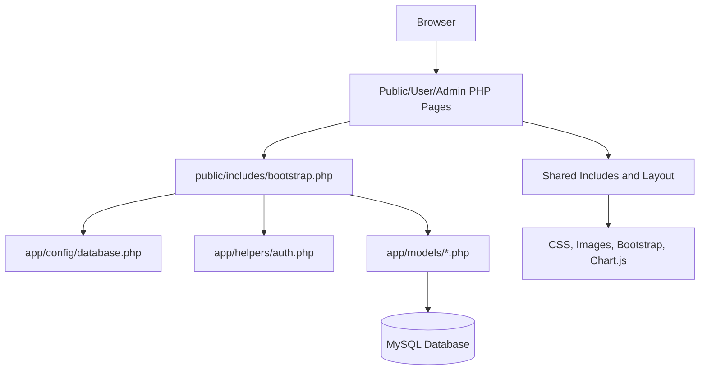

The browser sends a request to a PHP page. The PHP page loads `bootstrap.php`, which loads the database connection, helper functions, and model classes. The page creates model objects and calls methods to read or write data. Then the page renders HTML.

## 6. Request Lifecycle

Most pages follow the same pattern:

1. Load `bootstrap.php`.
2. Load `layout.php` if the page renders a full UI.
3. Check authentication using `requireAuth()`.
4. Check role using `requireRole()`.
5. Connect to the database using `Database::connect()`.
6. Create model objects such as `new Reservation($db)`.
7. If the request is `POST`, process the submitted form.
8. Validate the input.
9. Call model methods to create, update, delete, or query records.
10. Save flash messages with `setFlash()`.
11. Redirect after successful or failed form processing.
12. If the request is `GET`, load data and render the page.

This pattern is called POST-Redirect-GET. It helps prevent duplicate form submissions when the browser is refreshed.

Example from the login flow:

```text
Browser submits email/password
-> public/auth/login.php receives POST
-> User model checks the account
-> auth helper stores the session
-> user is redirected to admin or user dashboard
```

## 7. OOP Classes And Their Responsibilities

The main OOP code is inside `app/models/`.

### Database Class

File: `app/config/database.php`

Purpose:

- Stores database connection settings.
- Creates a PDO connection.
- Sets PDO error mode.
- Allows pages/models to use the same database connection pattern.

Important method:

| Method | Purpose |
| --- | --- |
| `connect()` | Returns a PDO connection to the MySQL database. |

Presentation explanation:

```text
The Database class is responsible for connecting PHP to MySQL. Other parts of the system do not manually create database connections.
```

### User Model

File: `app/models/User.php`

Purpose:

- Handles user accounts.
- Handles login authentication.
- Handles admin user CRUD.
- Validates email and password rules.

Important methods:

| Method | Purpose |
| --- | --- |
| `countUsers()` | Counts registered accounts. Used for dashboard and first-admin registration logic. |
| `all()` | Gets all users for the admin Users page. |
| `find()` | Finds a user by ID. |
| `findByEmail()` | Finds a user by email. |
| `create()` | Creates a new user and hashes the password. |
| `authenticate()` | Checks email/password using `password_verify()`. |
| `update()` | Updates user details and optionally password. |
| `delete()` | Deletes a user account. |

Presentation explanation:

```text
The User model owns account data. Pages do not directly check passwords. They call User::authenticate(), and the model uses password_verify().
```

### Guest Model

File: `app/models/Guest.php`

Purpose:

- Stores guest contact details.
- Supports walk-in guests and registered users.
- Lets admins search guest records.
- Shows guest reservation history.

Important methods:

| Method | Purpose |
| --- | --- |
| `search()` | Searches guests by name, phone, or email. |
| `reservationHistory()` | Gets a guest's reservation and payment history. |
| `create()` | Creates a guest record. |
| `update()` | Updates guest details. |
| `upsertFromDetails()` | Finds or creates a guest from submitted reservation details. |
| `ensureForUser()` | Ensures a registered user has a guest profile. |

Presentation explanation:

```text
The Guest model separates hotel guest information from login account information. This is useful because some guests may be walk-in customers without user accounts.
```

### Room Model

File: `app/models/Room.php`

Purpose:

- Manages room inventory.
- Stores room numbers, room types, floor, price, and status.
- Handles room CRUD.
- Handles room summaries for dashboard.
- Handles XML export/import.

Important methods:

| Method | Purpose |
| --- | --- |
| `types()` | Returns the allowed room types. |
| `statuses()` | Returns the allowed room statuses. |
| `all()` | Gets all rooms. |
| `availableRooms()` | Gets available rooms. |
| `find()` | Finds one room by ID. |
| `create()` | Creates a room record. |
| `update()` | Updates a room record. |
| `updateTypePrice()` | Updates the price of all rooms under one room type. |
| `delete()` | Deletes a room if allowed by database rules. |
| `statusSummary()` | Counts available and unavailable rooms. |
| `typeSummary()` | Groups room counts and prices by room type. |
| `exportToXml()` | Converts room records into XML. |
| `importFromXml()` | Reads XML and creates/updates room records. |

Presentation explanation:

```text
The Room model owns room inventory. Prices are stored in the database, so room prices are dynamic and can be changed by the admin instead of editing PHP code.
```

### Reservation Model

File: `app/models/Reservation.php`

Purpose:

- Manages reservations.
- Validates booking dates.
- Validates guest, room, status, and total amount.
- Prevents room date overlaps.
- Finds available rooms by date range.
- Validates that a room card was manually selected.
- Extends active stays only when the same room has no active booking overlap for the added dates.
- Handles reservation status flow.
- Generates dashboard and report data.

Important methods:

| Method | Purpose |
| --- | --- |
| `all()` | Gets all reservations for admin. |
| `find()` | Gets one reservation with guest and room details. |
| `userReservations()` | Gets reservations for one logged-in user. |
| `create()` | Creates a reservation. |
| `createAndGetId()` | Creates a reservation and returns its ID. |
| `update()` | Updates a reservation. |
| `delete()` | Deletes a reservation and recalculates the related room status. |
| `updateStatus()` | Changes reservation status and recalculates room status from remaining active reservations. |
| `extendStay()` | Extends an active reservation in the same room and increases the reservation total. |
| `availableFrontDeskActions()` | Determines which buttons should appear based on current status. |
| `applyFrontDeskAction()` | Applies Confirm, Check In, Check Out, or Cancel. |
| `roomsWithDateAvailability()` | Gets rooms and marks whether each room is available for selected dates. |
| `roomIsAvailable()` | Checks if one room has an active overlapping booking. |
| `operationalAlerts()` | Finds dashboard alert items such as overdue check-outs or overlap conflicts. |
| `occupancyReport()` | Builds occupancy report data. |
| `reservationTrendReport()` | Builds reservation trend report data. |

Presentation explanation:

```text
The Reservation model is one of the most important OOP classes because it protects the booking rules. It checks date ranges, room overlaps, selected room records, and reservation status before saving data.
```

### Payment Model

File: `app/models/Payment.php`

Purpose:

- Manages payment records.
- Generates transaction references.
- Tracks pending, confirmed, failed, and refunded payments.
- Supports simulated transactions.
- Prevents overpayment.
- Calculates reservation payment totals and balances.
- Builds revenue reports.

Important methods:

| Method | Purpose |
| --- | --- |
| `methods()` | Returns allowed payment methods. |
| `statuses()` | Returns allowed payment statuses. |
| `generatedReference()` | Creates references like `PAY-00001-YYYYMMDDHHMMSS` or `SIM-00001-YYYYMMDDHHMMSS`. |
| `create()` | Creates a payment record. |
| `createAndGetId()` | Creates a payment and returns its ID. |
| `updateStatus()` | Changes payment status during admin review. |
| `forReservation()` | Gets all payments for one reservation. |
| `totalsForReservation()` | Calculates total, confirmed, pending, balance, and remaining payable amount. |
| `recent()` | Gets recent payments for dashboard. |
| `revenueThisMonth()` | Gets confirmed revenue for the current month. |
| `summaryByStatus()` | Groups payments by status for charts. |
| `failedPayments()` | Gets failed payment records for dashboard alerts. |
| `revenueReport()` | Builds confirmed revenue reports by room type and payment method. |

Presentation explanation:

```text
The Payment model controls the transaction logic. Pending and confirmed payments are counted as active, and the model prevents their total from becoming higher than the reservation total.

When confirmed payments reach the full reservation total, the Payment model automatically changes a Pending reservation to Confirmed. This keeps the reservation table from showing a manual Confirm button after the booking is already paid.
```

## 8. Database Tables

The database name is `emperors_hotel_db`.

The main SQL file is `database/schema.sql`.

The system has five main tables:

| Table | Purpose |
| --- | --- |
| `users` | Stores login accounts and roles. |
| `guests` | Stores guest contact details. |
| `rooms` | Stores room inventory, room type, floor, status, and price. |
| `reservations` | Stores booking records. |
| `payments` | Stores payment and transaction records. |

## 9. Database Relationships

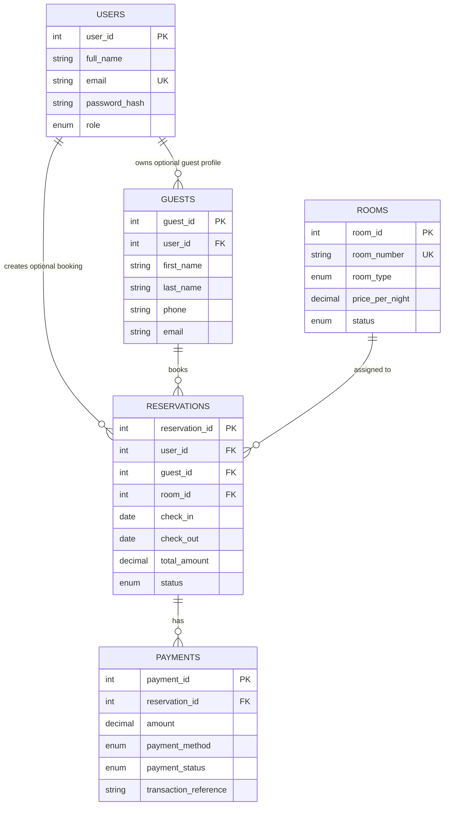

Relationship explanation:

| Relationship | Meaning |
| --- | --- |
| `users` to `guests` | A registered user can have a guest profile. |
| `users` to `reservations` | A registered user can create reservations. |
| `guests` to `reservations` | A guest can have many reservations. |
| `rooms` to `reservations` | A room can be assigned to many reservations over time, but not overlapping active reservations. |
| `reservations` to `payments` | One reservation can have many payment records. |

## 10. Authentication Flow

Files involved:

- `public/auth/login.php`
- `public/auth/register.php`
- `public/auth/logout.php`
- `app/models/User.php`
- `app/helpers/auth.php`

### Registration

Flow:

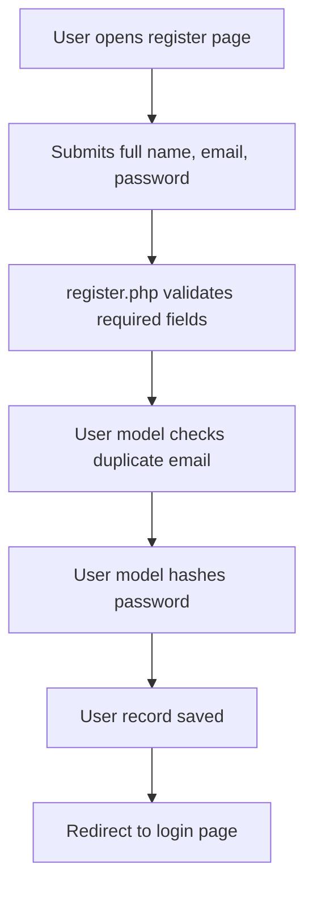

Important behavior:

- The first account can choose the admin role.
- Later registered accounts become normal users.
- Passwords are stored using `password_hash()`.
- Duplicate email addresses are not allowed.

### Login

Flow:

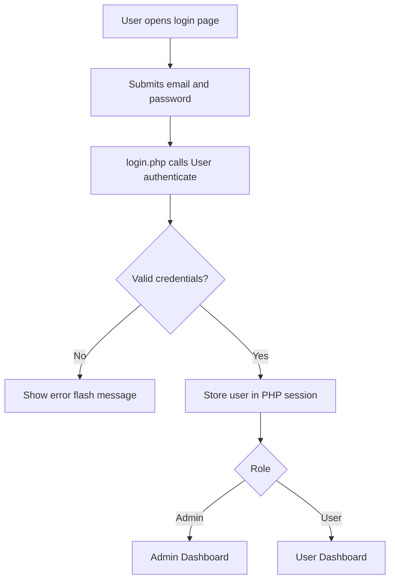

Important behavior:

- `User::authenticate()` checks the email and password.
- `password_verify()` compares the submitted password with the stored hash.
- `loginUser()` stores user data in the session.
- `requireRole()` protects admin and user pages.

## 11. Public Website Flow

Files involved:

- `public/site/home.php`
- `public/site/rooms.php`
- `public/includes/room_catalog.php`
- `app/models/Room.php`

Flow:

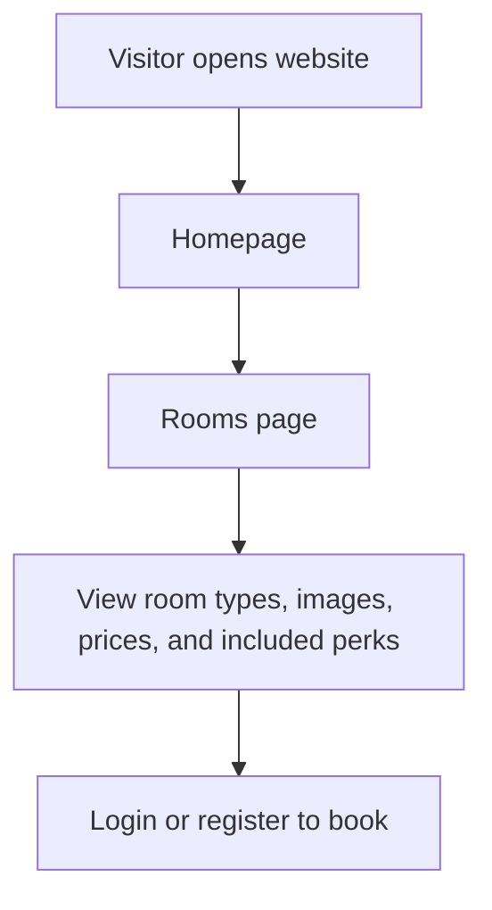

Important behavior:

- The homepage and rooms page are public.
- Room prices come from the database.
- Room type inclusions come from simple PHP catalog data.
- Room images and carousel content are loaded from local assets.
- The hotel logo SVG is used for branding and favicon.

## 12. User Reservation Flow

Files involved:

- `public/user/dashboard.php`
- `public/user/room-availability.php`
- `public/includes/room_selection.php`
- `public/includes/room_availability_api.php`
- `app/models/Guest.php`
- `app/models/Room.php`
- `app/models/Reservation.php`
- `app/models/Payment.php`

Flow:

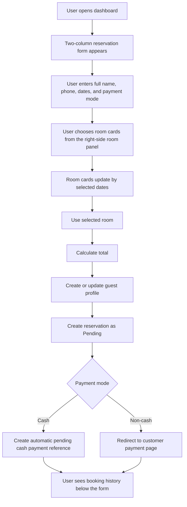

What the user form collects:

| Field | Purpose |
| --- | --- |
| Full name | Used to create/update the guest profile. |
| Room card | Chooses which room will be reserved. The yellow card badge shows the room number. |
| Check-in and check-out | Used for date validation and availability checking. |
| Capacity note | Shows that each room can hold up to 5 people. No adult/child split is required. |
| Phone | Stored in the guest profile. |
| Room inclusions | Shows what is already included with the selected room type. |
| Payment mode | Decides whether an automatic cash payment reference is generated or the payment page is opened. |

Important behavior:

- Room cards dynamically update when dates change.
- The user dashboard places stay details and payment fields on the left, room selection cards on the right, and booking history below.
- User room cards use a three-card desktop layout for easier scanning.
- Green/red availability indicators tell the user which rooms are available.
- Room cards show a simple "up to 5 people" capacity label instead of adult/child limits.
- Room totals are calculated in the cost tracker.
- Cash creates an automatic pending cash payment reference for the full reservation total.
- Credit card, debit card, bank transfer, online payment, and other non-cash modes go to `public/user/payment.php`.

## 13. Admin Walk-In Reservation Flow

Files involved:

- `public/admin/reservations.php`
- `public/admin/booking-records.php`
- `public/admin/room-availability.php`
- `public/includes/room_selection.php`
- `public/includes/room_availability_api.php`
- `app/models/Guest.php`
- `app/models/Room.php`
- `app/models/Reservation.php`
- `app/models/Payment.php`

Flow:

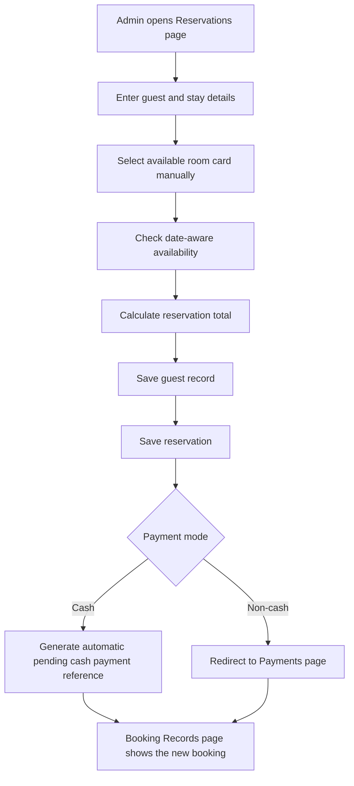

The `Reservations` page is now only for creating a walk-in reservation. Existing bookings are managed from the separate `Booking Records` tab.

Admin reservation actions are opened from one Manage button in the Booking Records table. The modal keeps the table readable while still showing the full reservation details, payment totals, and available actions:

| Action | Meaning |
| --- | --- |
| Create | Adds a new walk-in reservation. |
| Delete | Removes the reservation record. |
| Confirm | Changes pending reservation to confirmed. |
| Check In | Marks the guest as checked in and room as occupied. |
| Extend Stay | Moves the check-out date later if the same room is available for the added date range. |
| Check Out | Marks the reservation checked out and room available again. |
| Cancel | Cancels the reservation and releases the room. |
| Receipt | Opens the printable receipt page. |

The action area is split into rows for front desk status actions, document/payment links, stay extension, and delete. This keeps the table easier to read even when a reservation has several available actions.

## 14. Date-Aware Room Availability

Files involved:

- `public/user/room-availability.php`
- `public/admin/room-availability.php`
- `public/includes/room_availability_api.php`
- `public/includes/room_selection.php`
- `app/models/Reservation.php`

The system does not only check `rooms.status`. It also checks whether the selected date range overlaps with an active reservation.

Active statuses for availability are:

- `Pending`
- `Confirmed`
- `Checked-in`

Cancelled and checked-out records do not block future booking.

Availability logic:

```text
A room is unavailable for a selected date range if:
existing.check_in < new.check_out
AND existing.check_out > new.check_in
AND existing reservation status is active
```

This overlap rule is important because hotels can book the same room many times across different dates, but not for overlapping stays.

Example:

| Existing Stay | New Stay | Available? |
| --- | --- | --- |
| June 1 to June 3 | June 3 to June 5 | Yes, because the first stay checks out on June 3. |
| June 1 to June 3 | June 2 to June 4 | No, because the dates overlap. |
| June 1 to June 3 | May 29 to June 1 | Yes, because the new stay checks out on June 1. |

The room cards call the availability endpoint through JavaScript, then update the UI labels.

On the user dashboard, the room selection panel sits beside the booking details instead of being buried in the same narrow column. The yellow badge on each room card shows the room number, while the main card title shows the room type.

Stay extensions use the same overlap idea, but only for the added date range. For example, if a checked-in guest originally checks out on June 3 and wants to stay until June 5, the system checks whether the same room has another active reservation from June 3 to June 5. If another reservation uses that room during those added dates, the extension is rejected.

## 15. Manual Room Selection Logic

File involved:

- `app/models/Reservation.php`

The system requires the user or admin to choose one room card before saving a reservation. This keeps the project easier to explain because the selected room is always visible before the form is submitted.

The system checks:

1. Is a room card selected?
2. Is the date range valid?
3. Is the room available for the selected dates?
If any date, room, or required-field check fails, the reservation is not saved and the form shows an error message.

Presentation explanation:

```text
The room is not chosen automatically. The customer or admin selects a room card, and the backend validates that the room can really be booked for those dates.
```

## 16. Reservation Cost Calculation

Files involved:

- `public/user/dashboard.php`
- `public/admin/reservations.php`
- `public/includes/room_catalog.php`
- `public/includes/room_selection.php`

The reservation total is based on:

```text
number of nights * room price per night
```

Room price comes from:

```text
rooms.price_per_night
```

Room type inclusions do not add extra cost because they are descriptive catalog text.

Example:

```text
Room price per night: PHP 4,500
Stay length: 2 nights
Total = 4,500 * 2
Total = PHP 9,000
```

For stay extensions, the system adds only the extra room-night cost to the existing reservation total. After the total increases, the Payments page shows the added balance so the receptionist can collect the additional payment.

## 17. Room Inclusions

Files involved:

- `public/includes/room_catalog.php`
- `public/includes/room_selection.php`

The system has three room types with simple included perks:

| Room Type | Included Perks |
| --- | --- |
| Imperial Deluxe | Complimentary breakfast set |
| Royal Executive | Breakfast buffet plus priority Wi-Fi |
| Emperor Presidential | Breakfast buffet, car shuttle, and late checkout |

The included perks are plain room catalog descriptions, not a separate database module. They are shown to help guests understand the room type, but they do not change the reservation total.

## 18. Payment Flow

Files involved:

- `public/user/dashboard.php`
- `public/user/payment.php`
- `public/admin/reservations.php`
- `public/admin/booking-records.php`
- `public/admin/payments.php`
- `app/models/Payment.php`
- `public/admin/receipt.php`

Payment methods:

- Cash
- Credit Card
- Debit Card
- Bank Transfer
- Online Payment
- Other

Payment statuses:

- Pending
- Confirmed
- Failed
- Refunded

### Cash Flow

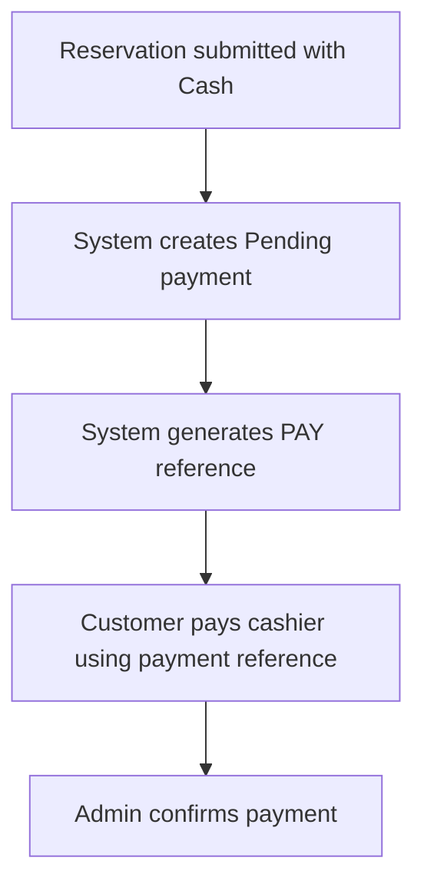

Cash does not go to the customer payment page. It creates an automatic pending cash payment reference that the customer can show to the cashier.

### Non-Cash Flow

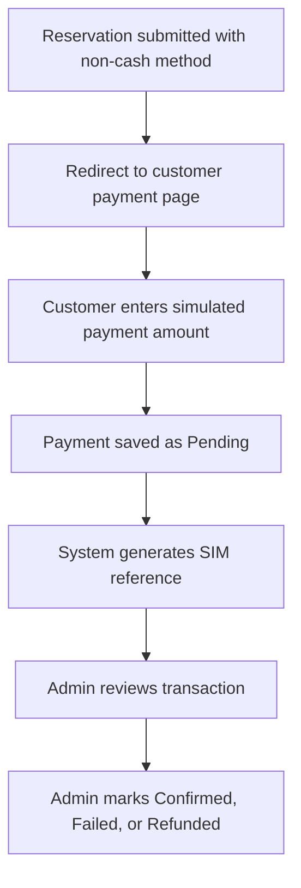

Non-cash payments are simulated because the project does not connect to a real payment gateway.

## 19. Transaction References

File involved:

- `app/models/Payment.php`

References are generated automatically. Staff and customers do not type the official system reference manually.

Reference examples:

```text
PAY-00001-20260527143022
SIM-00001-20260527143022
```

Meaning:

| Prefix | Meaning |
| --- | --- |
| `PAY` | Manual payment or automatic pending cash payment reference. |
| `SIM` | Simulated transaction. |

The reservation ID is padded in the reference so it is easier to trace.

## 20. Partial Payment And Overpayment Rules

File involved:

- `app/models/Payment.php`

The system allows partial payments. For example, a reservation total can be PHP 10,000 and the customer can pay PHP 5,000 first.

The system tracks:

| Amount | Meaning |
| --- | --- |
| Reservation total | Full amount to be paid. |
| Confirmed amount | Payments already accepted by admin. |
| Pending amount | Payments waiting for review. |
| Balance due | Reservation total minus confirmed amount. |
| Active balance due | Reservation total minus confirmed and pending amounts. |

Important rule:

```text
Pending + Confirmed payments cannot exceed the reservation total.
```

Failed and refunded payments stay in the transaction log, but they do not reduce the payable balance.

Only Pending transactions are editable in the payment review table. Once a transaction is Confirmed, Failed, or Refunded, it becomes a locked history record.

If the confirmed payment total fully covers a Pending reservation, the system automatically marks the reservation as Confirmed.

Example:

```text
Reservation total: PHP 10,000
Confirmed: PHP 4,000
Pending: PHP 3,000
Maximum new active payment allowed: PHP 3,000
```

If someone tries to add PHP 4,000 more, the Payment model rejects it.

## 21. Admin Payment Review

Files involved:

- `public/admin/payments.php`
- `app/models/Payment.php`

The admin can:

- Record a manual payment.
- Create a simulated transaction.
- View payment summaries.
- View transaction logs.
- Update payment status.
- Review pending transactions.

Why review is needed:

```text
Simulated and pending payments are not automatically trusted. Admin review represents the cashier/front desk confirming that the payment is valid.
```

Cash/card payments accepted directly at the counter can be marked Confirmed immediately.

## 22. Receipt Flow

Files involved:

- `public/admin/receipt.php`
- `app/models/Reservation.php`
- `app/models/Payment.php`

The receipt page shows:

- Guest details.
- Room details.
- Stay dates.
- Number of nights.
- Room capacity note: good for up to 5 people.
- Room inclusions.
- Reservation total.
- Confirmed paid amount.
- Pending review amount.
- Balance due.
- Transaction log.

The admin can print the receipt using the browser print action.

Important point:

```text
The receipt is generated from live reservation and payment records. It is not stored as a separate table.
```

## 23. Guest Search And History

Files involved:

- `public/admin/guests.php`
- `app/models/Guest.php`
- `app/models/Reservation.php`
- `app/models/Payment.php`

The Guests page allows admins to search by:

- Guest name
- Phone
- Email

When a guest is selected, the page shows:

- Past and current reservations.
- Room details.
- Reservation statuses.
- Confirmed payments.
- Pending payments.
- Balance due.
- Receipt links.

This helps the hotel front desk answer questions like:

```text
Has this guest stayed before?
What room did they book?
Do they still have a balance?
Can we print their receipt?
```

## 24. Admin Dashboard

Files involved:

- `public/admin/dashboard.php`
- `app/models/User.php`
- `app/models/Room.php`
- `app/models/Reservation.php`
- `app/models/Payment.php`
- `public/assets/vendor/chartjs/chart.umd.min.js`

The dashboard is the admin overview page.

It shows:

- Registered user count.
- Customers this month.
- Revenue this month.
- Available rooms.
- Pending reservations.
- Upcoming check-outs.
- Operational alerts.
- Monthly bookings and revenue chart.
- Reservation status chart.
- Room status chart.
- Payment status chart.
- Recent reservations.
- Recent payment activity.

Operational alerts include:

- Overdue check-outs.
- Failed payments.
- Overlap conflicts.

Chart flow:

```text
Model queries MySQL
-> dashboard.php prepares arrays
-> json_encode() sends data to JavaScript
-> Chart.js renders the charts in canvas elements
```

## 25. Reports Page

Files involved:

- `public/admin/reports.php`
- `app/models/Reservation.php`
- `app/models/Payment.php`

The Reports page allows admins to filter by date range and view:

| Report | Data Source | Meaning |
| --- | --- | --- |
| Occupancy report | `reservations` and `rooms` | Shows booked room nights, available room nights, and occupancy rate. |
| Revenue report | `payments`, `reservations`, and `rooms` | Shows confirmed revenue by room type and payment method. |
| Reservation trend report | `reservations` | Shows daily active, cancelled, and total reservation counts. |

The Reports page is separate from the dashboard because the dashboard is for quick monitoring, while reports are for filtered analysis.

## 26. Room Management

Files involved:

- `public/admin/rooms.php`
- `app/models/Room.php`

Admin room management includes:

- Create room.
- Edit room.
- Delete room.
- Update room status.
- Bulk update price by room type.
- Import rooms from XML.
- Export rooms to XML.

Room statuses:

| Status | Meaning |
| --- | --- |
| Available | Room can be booked if dates are open. |
| Reserved | Room has a reservation but guest has not checked in. |
| Occupied | Guest is currently checked in. |

## 27. Room XML Import And Export

Files involved:

- `public/admin/rooms.php`
- `app/models/Room.php`

The system uses PHP `DOMDocument` for room XML import/export only. Other tables, such as users, guests, reservations, and payments, are managed through PHP CRUD pages and MySQL.

Export flow:

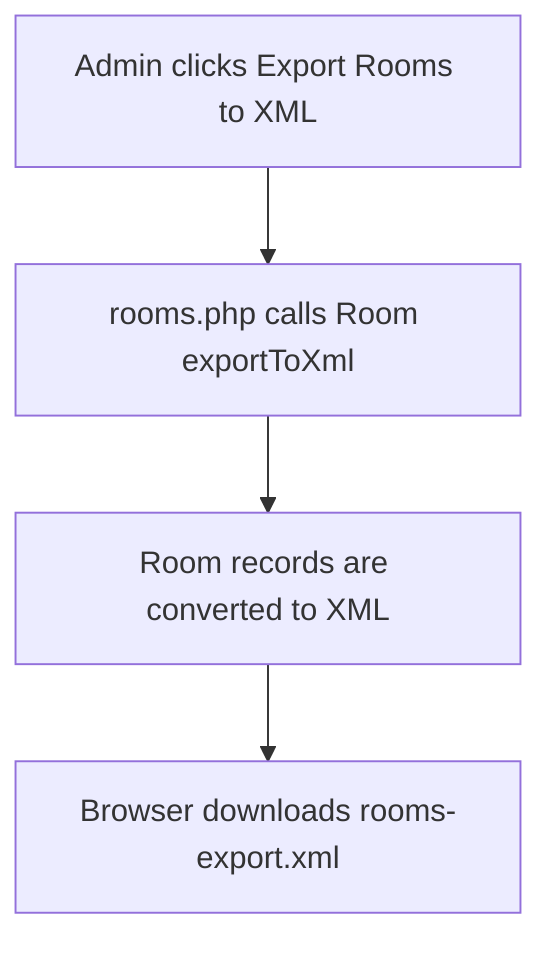

Import flow:

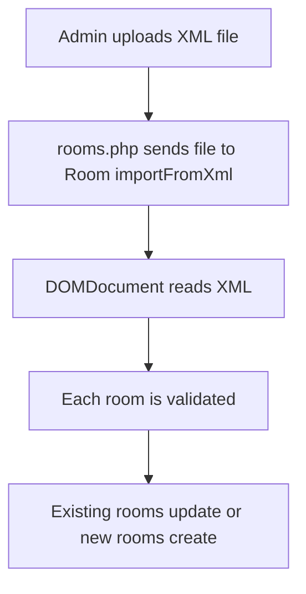

Expected XML shape:

```xml
<rooms>
  <room>
    <room_number>101</room_number>
    <room_type>Imperial Deluxe</room_type>
    <floor>1</floor>
    <price_per_night>4500.00</price_per_night>
    <status>Available</status>
  </room>
</rooms>
```

Presentation explanation:

```text
Room XML import/export is included to demonstrate file-based data exchange using PHP DOMDocument without adding unnecessary XML workflows for every table.
```

## 28. Role-Based Access Control

Files involved:

- `app/helpers/auth.php`
- All admin pages
- All user pages

The system uses PHP sessions and role checking.

Important helper functions:

| Helper | Purpose |
| --- | --- |
| `currentUser()` | Gets the logged-in user from the session. |
| `isLoggedIn()` | Checks if there is an active logged-in user. |
| `requireAuth()` | Redirects to login if the user is not logged in. |
| `requireRole()` | Redirects if the logged-in user does not have the required role. |
| `loginUser()` | Saves user data to the session. |
| `logoutCurrentUser()` | Clears the logged-in user session. |

Example:

```text
Admin pages call requireRole('admin', '../user/dashboard.php')
User pages call requireRole('user', '../admin/dashboard.php')
```

This prevents a normal user from opening admin pages directly.

## 29. Validation Rules

Validation happens in both page handlers and model classes.

Important validation examples:

| Area | Validation |
| --- | --- |
| Login | Email and password are required. |
| Registration | Required fields, matching password confirmation, duplicate email check. |
| User CRUD | Email format, password length, unique email, self-admin protection. |
| Guest | Required name fields and valid contact details. |
| Room | Valid room type, room status, room number, floor, and price. |
| Reservation dates | Check-in and check-out must be valid, future-facing, and check-out must be after check-in. |
| Room availability | Active overlapping reservations block the same room. |
| Reservation total | Total amount must be positive. |
| Payment amount | Amount must be positive. |
| Payment status | Must be one of the allowed statuses. |
| Overpayment | Pending plus confirmed payments cannot exceed reservation total. |
| Reports | Start/end date must be valid before report queries run. |

Important point:

```text
Client-side UI helps the user, but server-side validation is the source of truth.
```

This means even if a user edits HTML in the browser, the PHP model should still reject invalid data.

## 30. Security Features

The project includes several basic security practices:

| Feature | Where | Purpose |
| --- | --- | --- |
| Password hashing | `User.php` | Prevents storing plain text passwords. |
| Prepared statements | Model classes | Reduces SQL injection risk. |
| Output escaping | `e()` helper | Reduces HTML injection risk. |
| Role checks | `requireRole()` | Protects admin and user pages. |
| Session login state | `auth.php` | Tracks authenticated users. |
| Server-side validation | Models and pages | Rejects invalid or unsafe data. |

Current limitation:

```text
The project does not yet include CSRF tokens. If asked, explain that this is a future security improvement.
```

## 31. CSS And UI Organization

The CSS is organized to make the project easier to maintain.

| CSS Area | Purpose |
| --- | --- |
| `public/assets/css/app.css` | Shared styles used by multiple pages. |
| `public/assets/css/site/` | Public homepage and rooms page styles. |
| `public/assets/css/auth/` | Login and register styles. |
| `public/assets/css/user/` | User dashboard and payment page styles. |
| `public/assets/css/admin/` | Admin page-specific styles. |

The reason for page-specific CSS:

```text
When each page has its own CSS file, it is easier to find, debug, and update styles without accidentally affecting unrelated pages.
```

Shared layout functions in `public/includes/layout.php` load the needed CSS files.

## 32. Main User Flow From Start To Finish

This is the normal customer booking flow:

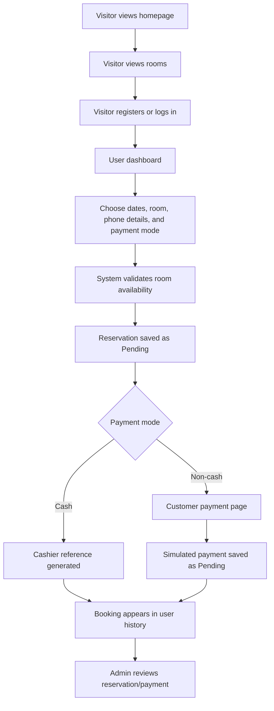

## 33. Main Admin Flow From Start To Finish

This is the normal front desk/admin flow:

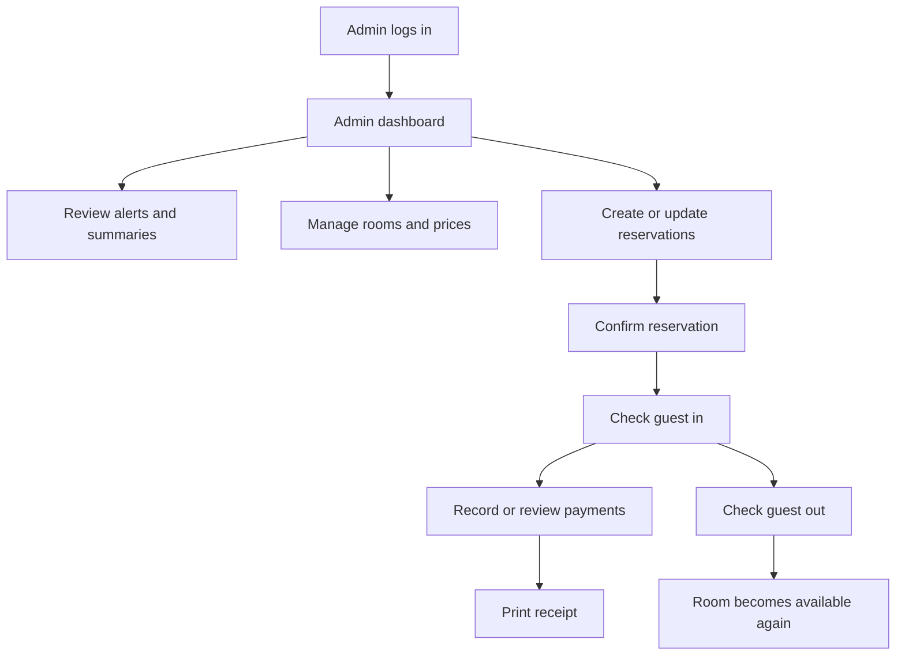

## 34. File-To-Feature Map

| Feature | Main Files |
| --- | --- |
| Login | `public/auth/login.php`, `app/models/User.php`, `app/helpers/auth.php` |
| Register | `public/auth/register.php`, `app/models/User.php` |
| Logout | `public/auth/logout.php`, `app/helpers/auth.php` |
| Public homepage | `public/site/home.php`, `public/includes/room_catalog.php` |
| Public room page | `public/site/rooms.php`, `app/models/Room.php`, `public/includes/room_catalog.php` |
| User booking | `public/user/dashboard.php`, `app/models/Reservation.php`, `app/models/Guest.php`, `app/models/Payment.php` |
| User payment | `public/user/payment.php`, `app/models/Payment.php` |
| Room availability API | `public/includes/room_availability_api.php`, `public/user/room-availability.php`, `public/admin/room-availability.php` |
| Admin dashboard | `public/admin/dashboard.php`, all major models |
| Rooms admin | `public/admin/rooms.php`, `app/models/Room.php` |
| Reservations admin | `public/admin/reservations.php`, `public/admin/booking-records.php`, `app/models/Reservation.php` |
| Stay extension | `public/admin/booking-records.php`, `app/models/Reservation.php` |
| Payments admin | `public/admin/payments.php`, `app/models/Payment.php` |
| Guests admin | `public/admin/guests.php`, `app/models/Guest.php` |
| Reports admin | `public/admin/reports.php`, `app/models/Reservation.php`, `app/models/Payment.php` |
| Receipt | `public/admin/receipt.php`, `app/models/Reservation.php`, `app/models/Payment.php` |
| Users admin | `public/admin/users.php`, `app/models/User.php` |
| Shared layout | `public/includes/layout.php` |
| Room card UI | `public/includes/room_selection.php` |
| Room catalog data | `public/includes/room_catalog.php` |

## 35. Why This Counts As An OOP PHP Project

This project uses OOP because the main data and business logic is grouped into classes:

- `Database`
- `User`
- `Guest`
- `Room`
- `Reservation`
- `Payment`

Each class has a clear responsibility.

Examples:

```text
User handles account logic.
Room handles room inventory logic.
Reservation handles booking logic.
Payment handles transaction logic.
```

The PHP pages do not contain all SQL directly. Instead, pages create model objects and call methods.

Example:

```php
$db = Database::connect();
$reservationModel = new Reservation($db);
$reservation = $reservationModel->find($reservationId);
```

This is OOP because:

- The model classes encapsulate related methods.
- The database connection is passed into constructors.
- Each class owns one main data area.
- Pages use objects to perform operations.
- Repeated logic is reusable instead of copied everywhere.

## 36. Why This Is Still A Student-Level Project

This project is stronger than a simple CRUD project, but still appropriate for a student OOP PHP system.

Student-level characteristics:

- It uses Core PHP instead of a full framework.
- Pages are PHP files that handle forms and render HTML.
- OOP is understandable because the model classes are visible.
- It uses MySQL tables that are easy to explain.
- Payments are simulated instead of integrated with real payment APIs.
- It runs in XAMPP.
- It does not require Node.js or advanced deployment.

Advanced student-level features:

- Date-aware room availability.
- Manual room-card selection.
- Overpayment prevention.
- Dashboard charts.
- Reports.
- Receipt printing.
- Room XML import/export.
- Role-based pages.
- Dynamic room prices.

Honest explanation:

```text
This is a student OOP PHP project with advanced capstone-style features. It is not a production hotel system yet, but it demonstrates the main concepts of database design, OOP models, CRUD, authentication, validation, reporting, and file import/export.
```

## 37. Common Defense Questions And Suggested Answers

### What is the main goal of the system?

The goal is to manage hotel room reservations for users and admins. Users can book rooms, while admins can manage room inventory, reservations, payments, guests, reports, and receipts.

### Where did you use OOP?

OOP is mainly used in the model classes inside `app/models/`. Each class represents a major system area, such as users, rooms, reservations, and payments. The pages create objects from these classes and call their methods.

### Why separate models from pages?

Separating models from pages makes the system easier to maintain. Pages focus on request handling and UI, while models focus on SQL queries and business rules.

### How do you prevent double booking?

The `Reservation` model checks if the selected room already has an active overlapping reservation. If the dates overlap with a Pending, Confirmed, or Checked-in reservation, the room is treated as unavailable.

### Why does the system require manual room selection?

Manual room selection keeps the reservation flow clearer for a walk-in hotel system. The customer or receptionist can see the room number, room type, price, and availability before saving the booking.

### What happens if a checked-in guest extends their stay?

The admin uses the Extend Stay form in the reservation table. The `Reservation` model checks if the same room is free for the added dates. If it is free, the check-out date is moved later and the reservation total increases by the extra room-night cost. The new balance is then collected through the Payments page.

### Where do room prices come from?

Room prices come from the `rooms.price_per_night` database field. Admins can update prices in the Rooms page, including bulk updates by room type.

### How do room inclusions work?

Each room type has simple included perks in `public/includes/room_catalog.php`. They are displayed during reservation as room information only, and they do not add extra cost.

### Is the payment real?

No. The payment system is simulated. It records payment data, statuses, balances, and transaction references, but it does not connect to real payment gateways like Stripe, PayPal, GCash, or Maya.

### Why do pending payments need admin review?

Pending or simulated payments are not automatically trusted. The admin reviews them and changes the status to Confirmed, Failed, or Refunded.

After review, the transaction is locked. This keeps confirmed paid records from being accidentally changed later.

### How do you prevent overpayment?

The `Payment` model calculates confirmed and pending payments for a reservation. It rejects a new active payment if the total would exceed the reservation total.

### What is XML used for?

XML is used for room import/export only. Admins can export room records to XML or import room records from an XML file using PHP `DOMDocument`.

### What is Chart.js used for?

Chart.js is used on the admin dashboard to show visual charts for monthly bookings/revenue, reservation status, room status, and payment status.

### What are the main limitations?

The system does not include a real payment gateway, email/SMS notifications, mobile app version, standalone offline mode, or CSRF tokens yet.

## 38. Best Way To Present The Project

Recommended presentation order:

1. Explain the problem: a hotel needs a reservation and front desk management system.
2. Explain the users: guests, registered users, and admins.
3. Show the public homepage and rooms page.
4. Register or log in as a user.
5. Create a reservation and explain date-aware availability.
6. Show the cost tracker and payment route.
7. Show the side-by-side user booking layout and booking history below it.
8. Log in as admin.
9. Show dashboard summaries, alerts, and charts.
10. Show room management and dynamic prices.
11. Show the Booking Records Manage modal: confirm, check in, check out, cancel, payment, receipt, extend stay, and delete.
12. Show payments and admin review.
13. Show guest history and receipt.
14. Show reports.
15. Explain the database ERD.
16. Explain OOP models and how pages call them.
17. Mention limitations and future improvements honestly.

## 39. Short Explanation Script

Use this if you need a quick spoken explanation:

```text
Our project is the Emperor Hotel Reservation and Management System. It is a Core PHP and MySQL web application for hotel booking and front desk management.

The system has public pages, user pages, and admin pages. Public visitors can view rooms. Registered users can book rooms, choose dates, select a payment mode, choose a room from card-based room selection, and view their booking history. Admins can manage rooms, reservations, payments, guests, users, receipts, dashboard charts, and reports.

We used OOP through model classes such as User, Guest, Room, Reservation, and Payment. These classes handle the database queries and business rules. The PHP pages mainly handle form submissions and display the UI.

The most important logic is in the Reservation and Payment models. The Reservation model validates dates, checks overlapping bookings, and requires a selected available room. The Payment model generates references, tracks pending and confirmed payments, and prevents overpayment.

The system also demonstrates room XML import/export using DOMDocument, dashboard charts using Chart.js, and role-based access using PHP sessions.

It is not a production hotel system yet because payments are simulated and there is no real payment gateway, but it demonstrates the core concepts required for an OOP PHP hotel reservation project.
```

## 40. Future Improvements

Good future improvements to mention:

- Add CSRF tokens to all forms.
- Add email or SMS booking notifications.
- Add real payment gateway integration.
- Add CSV/PDF export for reports.
- Add a dedicated arrivals/departures board.
- Add editable guest profile details.
- Add refund adjustment workflows.
- Add automated tests.
- Add more detailed audit logs for admin actions.

## 41. One-Sentence Summary

The Emperor Hotel Reservation and Management System is a Core PHP OOP hotel booking and front desk management project where PHP pages handle the interface, model classes handle business/database logic, and MySQL stores users, guests, rooms, reservations, and payments.
