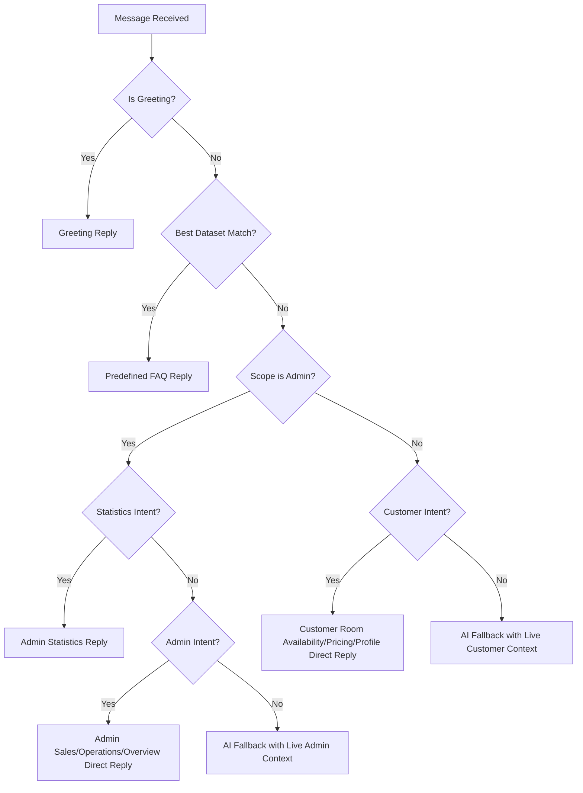

# AI Support Integration & Architecture

This document provides an in-depth explanation of the Emperor Hotel AI support system: its core features, dataset architecture, decision logic, date parsing, UI table rendering, standard Gemini API communication, and step-by-step guest and staff booking guides.

---

## 1. High-Level Purpose

The support widget gives the hotel two distinct AI-style help modes depending on the logged-in context:

- **Customer Support Mode**: For guests asking about rooms, availability, pricing, amenities, hotel policies, and instructions on how to book.
- **Admin Support Mode**: For hotel staff asking about dashboard performance metrics, monthly sales charts, room occupancy, operational check-out alerts, and report summaries.

The system uses a **Hybrid Strategy**:
1. **Local PHP Rules first**: It tries to match predefined FAQs, direct room details, or admin statistics from the live database.
2. **Gemini Fallback second**: It uses the Gemini API only when the query is conversational or open-ended, feeding the model real-time database context.

---

## 2. Directory Structure and Files Involved

| File | Type | Responsibility |
| --- | --- | --- |
| `public/includes/layout.php` | View Include | Renders the support widget container, launcher button, and configuration dataset tags. |
| `public/assets/js/support-widget.js` | JS Script | Handles widget client state, launcher toggle, panel maximisation, scroll alignment, keyword extraction, and a custom Markdown table rendering engine. |
| `public/support/api.php` | Controller API | Receives payloads, executes the PHP Support Assistant, structures alternating chat history turns, configures system instructions, and connects to the Gemini REST endpoint. |
| `app/models/SupportAssistant.php` | PHP Model | Resolves intent, runs pattern matches, extracts date ranges, and formats live database records into structured text/tables. |
| `app/models/Room.php` | PHP Model | Provides data on available rooms, inventory counts, and lowest pricing summaries per room type. |
| `app/models/Reservation.php` | PHP Model | Computes dashboard summary cards, monthly bookings and sales charts, occupancy rates, and check-out alerts. |
| `app/models/Payment.php` | PHP Model | Compiles revenue lists by room type and confirms sales over specific date ranges. |
| `app/config/hotel.php` | Configuration | Defines hotel identity attributes, including name, description, founding year, support email, and phone. |

---

## 3. Detailed Guest & Staff Booking Guides

The AI is equipped to provide step-by-step guidance on how booking and reservation actions are executed within the system.

### 3.1 Guest Booking Guide
When a customer asks *"how to book a room"*, *"how do I make a reservation"*, or similar queries, the AI returns the following structured guide:
1. **Log In**: The customer must log in to their guest account (or register if they are a new visitor).
2. **Go to User Dashboard**: Navigate to the booking area on their private dashboard (`public/user/dashboard.php`).
3. **Stay Dates**: Select the check-in and check-out dates using the stay details form on the left.
4. **Choose Room**: Browse the live room availability cards displayed in the right-hand panel and pick a preferred room.
5. **Choose Payment Mode**: Select "Cash" to pay at the front desk (creates a pending payment reference) or choose card/online transfer.
6. **Confirm Booking**: Submit the form. If card/online payment was chosen, the system redirects to a simulated secure payment page to finalize the transaction.
7. **Track Status**: The customer can review their reservation and its current status (Pending, Confirmed, etc.) in the "Booking History" table at the bottom of their dashboard.

### 3.2 Staff/Admin Walk-in Booking Guide
When staff or admins ask how to log a walk-in guest or execute front desk actions, the AI explains the workflow:
1. **Walk-in Reservation**: Go to the admin panel and select the **Reservations** page. Fill out the form (room, check-in/out dates, guest full name, email, and phone) and click Submit.
2. **Manage Booking Records**: Go to the **Booking Records** page (`public/admin/booking-records.php`).
3. **Modal Actions**: Click the **Manage** button on any reservation row. This opens an operations modal containing action controls:
   - **Confirm**: Verify the booking and switch status from Pending to Confirmed.
   - **Check-in / Check-out**: Log the physical arrivals and departures of guests.
   - **Extend Stay**: Adjust check-out dates for the same room without needing a new reservation.
   - **Payment / Receipt**: Record additional guest payments and generate printable receipts.
   - **Cancel / Delete**: Cancel the booking or delete the record.

---

## 4. Intelligent Decision Rules & Logic

When a message is received, `SupportAssistant::respond()` processes it sequentially:

### 4.1 Greeting Handling (`isGreeting`)
Naïve substring matching (e.g. `str_contains`) is replaced with strict word boundaries (`\b`). This prevents greetings like `"hi"` from triggering on words containing those characters (e.g. `"history"` or `"which"`).
Additionally, greeting interception is bypassed if the message is longer than three words and contains specific hotel keywords, allowing queries like *"hi, what are the room prices?"* to route directly to pricing rather than general greetings.

### 4.2 Predefined Dataset Matching (`findBestDatasetMatch`)
Predefined FAQs (WiFi passwords, breakfast hours, pool hours, cancellation policies, and hotel contact details) are evaluated using a phrase-coverage scoring formula:
$$Score = 0.55 + (Coverage \times 0.25) + \frac{PatternLength}{80}$$
This formula yields a high match score even when users ask questions using polite or lengthy phrasing (e.g., *"could you please tell me what the wifi password is?"*), preventing unnecessary fallbacks to Gemini.

---

## 5. Date and Month Range Extraction

Admins and guests often ask about relative dates, specific month names, or durations. `SupportAssistant::extractDateRange()` parses these inputs:

- **Relative Durations**: Supports `"yesterday"`, `"today"`, `"last 7 days"`, `"last 30 days"`, and `"last 90 days"`.
- **Calendar Months**: Supports all month names and abbreviations (e.g. `"june"`, `"december"`, `"jan"`, etc.).
- **Smart Year Resolution**: Resolves the correct year based on the current system date (July 2026). If the user asks about `"December"`, the system calculates December of the previous year (2025). If the user asks about `"June"`, it resolves to June 2026.
- **Specific Formats**: Parses explicit date strings like `"on YYYY-MM-DD"` or `"from YYYY-MM-DD to YYYY-MM-DD"`.

If no date range is mentioned, queries default to the current month's start and end dates.

---

## 6. Real-Time Context Injection for Gemini

When a query is too open-ended for local rules, the system queries the MySQL database and injects real-time data into the context sent to Gemini:

### Customer Context
- **Hotel Profile**: Live name, description, founding year, support email, and support phone.
- **Room Availability**: Lists room numbers, floor levels, type names, and prices for all rooms currently marked "Available".
- **Catalog & Pricing**: Includes description details, feature lists, included perks (e.g. baby cribs, priority Wi-Fi, breakfast sets), and the lowest pricing recorded for each room type.

### Admin Context
- **Live Counters**: Active customer counts, pending reservations, and upcoming check-out alerts.
- **Monthly Performance**: Historical bookings and confirmed revenue metrics spanning the last six months.
- **Room Inventory Status**: Occupancy levels and available counts grouped by room type.
- **Operational Alerts**: List of overdue check-outs (room numbers, guest names, and stay ranges).
- **Range Performance**: Total revenue, created bookings, and occupancy percentage for the requested range.

---

## 7. Gemini API Request Protocol

The fallback request is executed in `public/support/api.php` via standard REST parameters:

- **camelCase System Instruction**: Configures the instructions using the official `systemInstruction` field (rather than the deprecated snake_case `system_instruction`).
- **Alternating Conversation Turns**: Chat history is formatted as alternating turns of `user` and `model` roles.
- **Consecutive Role Merging**: Consecutive user or assistant messages are automatically combined in the payload to ensure strict role-alternation compliance, preventing API schema validation errors.

---

## 8. Client-Side HTML Table Parsing & Rendering

To keep data structured and readable, room lists and report stats are sent to the client as Markdown tables. The parsing script in `support-widget.js` compiles this output:

- **Line Ending Normalization**: Converts Windows carriage returns (`\r\n`) to standard UNIX line endings (`\n`) before parsing to prevent double-newline regex mismatches.
- **Line-by-Line Parser**: Evaluates consecutive lines starting with `|`. A table divider check (`/^\s*\|[\s:-|]+\|\s*$/`) is performed on the second line to confirm structure.
- **No Column Shifts**: Strips leading and trailing split delimiters (`|`) rather than running `filter(Boolean)`. This preserves empty cells in their correct columns instead of shifting them to the left.
