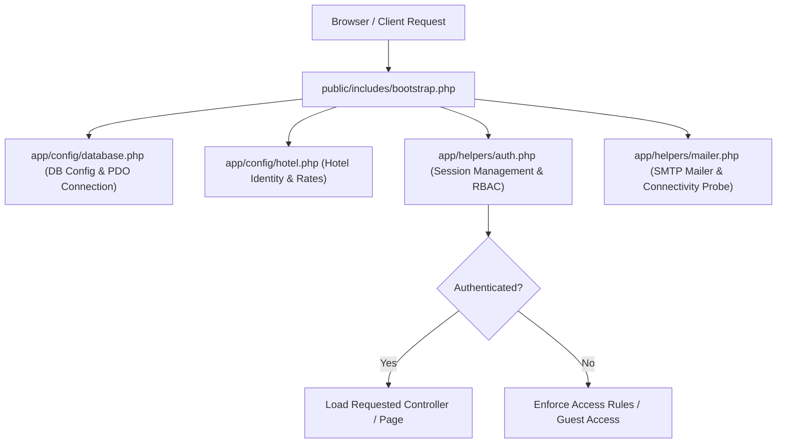
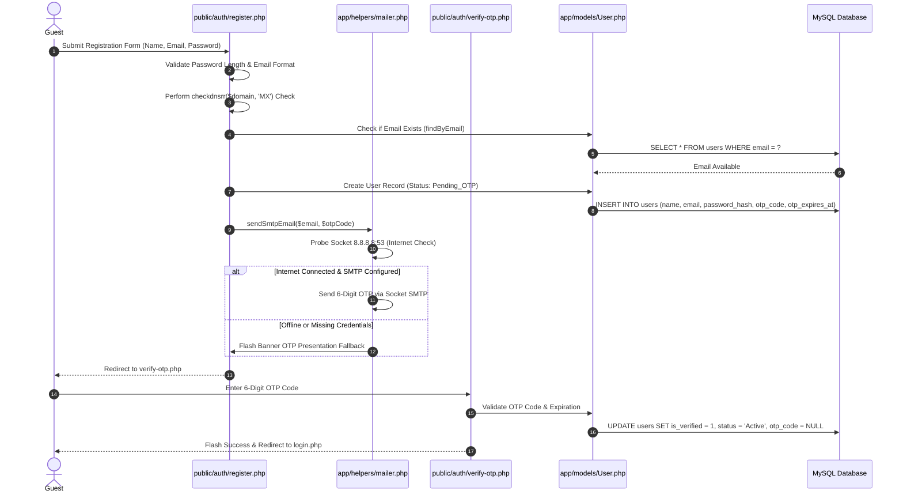
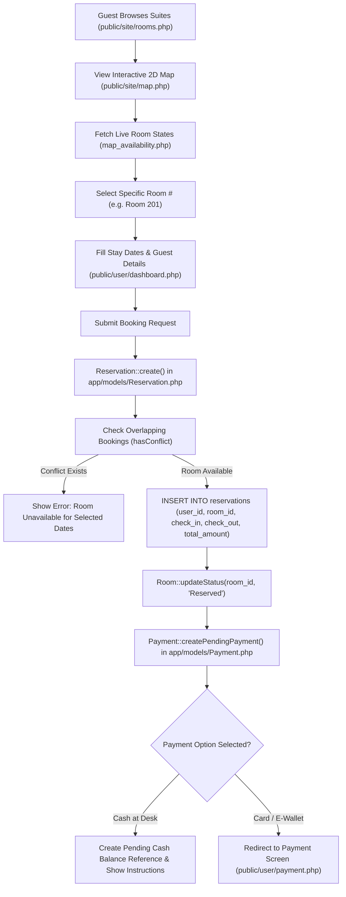
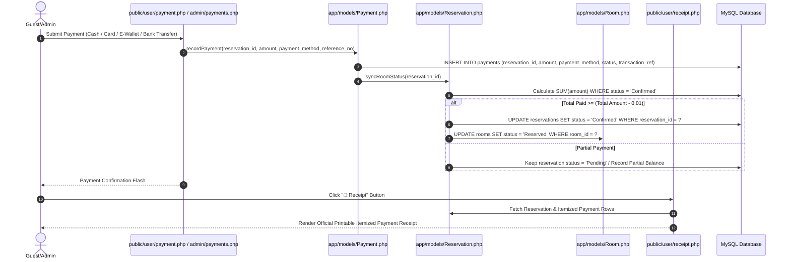
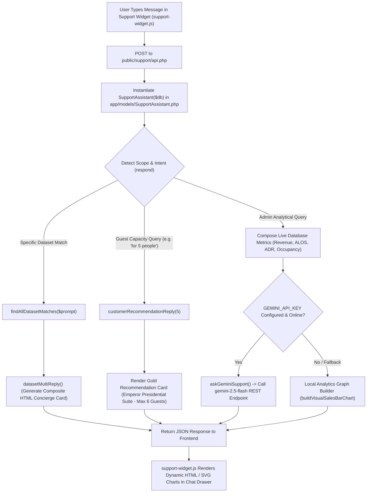
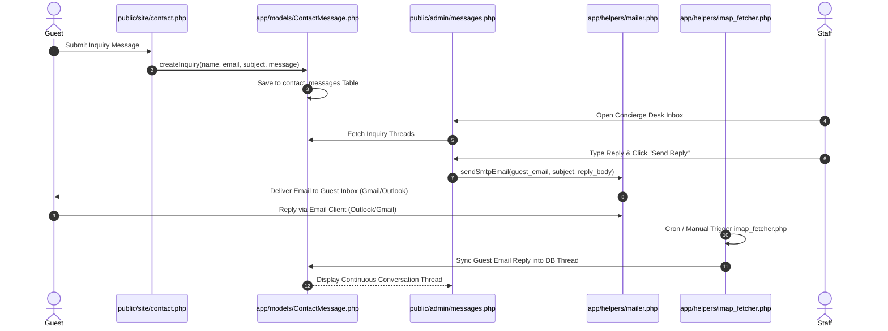
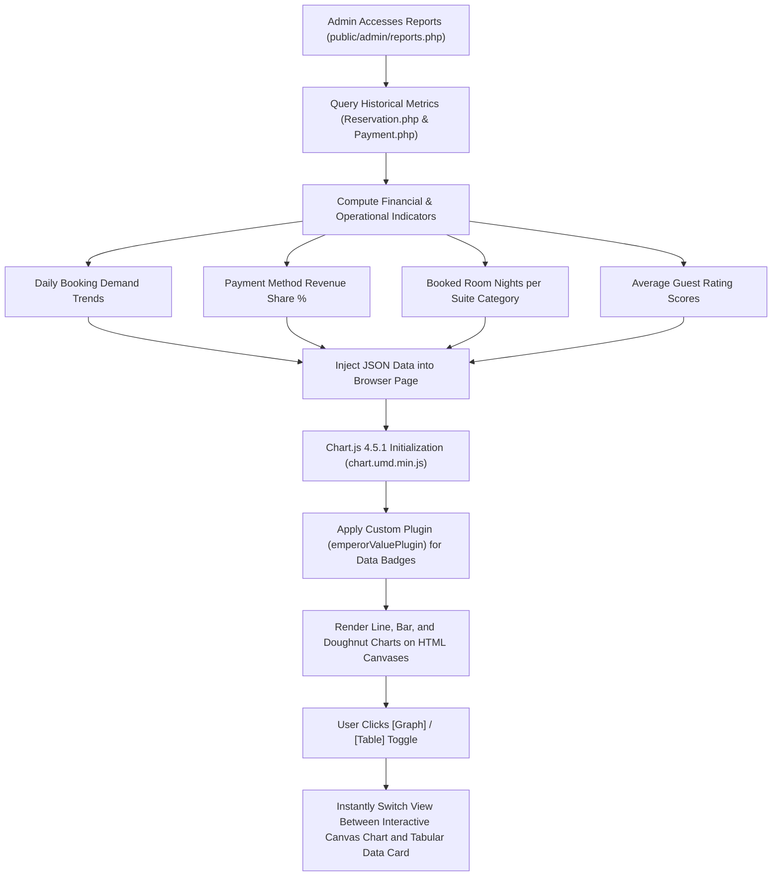

# Emperor Hotel — Full System Deep Scan: Code Flow & Feature Process Guide

This document presents a complete, end-to-end architectural map of the **Emperor Hotel Management & Reservation System**. It details how HTTP requests move from **file to file**, how data flows between backend models and the MySQL database, and how all core features execute.

---

## 🏛️ 1. Core Architecture & Bootstrap Pipeline

Every user or admin request passes through a unified bootstrap entry point before reaching page controllers or API endpoints.



### File-to-File Data Dependency Pipeline
1. `public/includes/bootstrap.php`: Starts native PHP sessions, defines root directory constants, loads helper files.
2. `app/config/database.php`: Manages the singleton `Database::connect()` PDO database instance.
3. `app/helpers/auth.php`: Defines `currentUser()`, `requireLogin()`, `requireAdmin()`, `generateCsrfToken()`, and `validateCsrfToken()`.
4. `app/models/*.php`: Instantiated dynamically with the active PDO instance (`new Reservation($db)`, `new Room($db)`, etc.).

---

## 🔑 2. User Authentication & 2FA Process Flow

Handles guest registration, live DNS MX record checks, 6-digit OTP verification, session authorization, and password resets.



### Key Files Involved:
* `public/auth/register.php` $\rightarrow$ Registration form & MX domain lookup.
* `public/auth/verify-otp.php` $\rightarrow$ 6-digit OTP verification & account activation.
* `public/auth/login.php` $\rightarrow$ Password verification (`password_verify`) & session creation.
* `public/auth/forgot-password.php` $\rightarrow$ Password reset token generation & email dispatch.
* `app/models/User.php` $\rightarrow$ User CRUD & authentication query methods.

---

## 🏨 3. Room Discovery, 2D Map Selection & Booking Flow

Covers how guests browse room categories, inspect real-time availability on the interactive 2D map, submit reservation details, and lock inventory.



### Key Files Involved:
* `public/site/rooms.php` & `public/site/room-detail.php` $\rightarrow$ Suite catalog & details.
* `public/site/map.php` & `public/site/map_availability.php` $\rightarrow$ Interactive 2D vector room map.
* `public/user/dashboard.php` $\rightarrow$ Guest dashboard & reservation creation controller.
* `app/models/Reservation.php` $\rightarrow$ Overlap collision detection (`hasConflict()`) & SQL transaction logging.
* `app/models/Room.php` $\rightarrow$ Room status lifecycle manager.

---

## 💰 4. Multi-Channel Payment & Financial Accounting Flow

Manages payment verification, partial/full balance tracking, receipt printing, and automated reservation status promotion.



### Key Files Involved:
* `public/user/payment.php` $\rightarrow$ Guest online payment gateway simulation.
* `public/admin/payments.php` $\rightarrow$ Admin payment approval, refund logging, & manual record entry.
* `public/user/receipt.php` & `public/admin/receipt.php` $\rightarrow$ Printable itemized payment receipts.
* `app/models/Payment.php` $\rightarrow$ Financial accounting rules & transaction loggers.

---

## 🤖 5. AI Support Assistant & Analytics Engine Flow

Integrates the Google Gemini API with local database queries to deliver intelligent room recommendations, concierge answers, and executive visual charts.



### Key Files Involved:
* `public/assets/js/support-widget.js` $\rightarrow$ Frontend chat drawer widget UI handler.
* `public/support/api.php` $\rightarrow$ API endpoint & Gemini REST client (`askGeminiSupport`).
* `app/models/SupportAssistant.php` $\rightarrow$ Natural language parser, dataset matcher, & visual graph generator.

---

## 📩 6. Guest Concierge Inbox & Email Thread Sync Flow

Enables bi-directional communication between guests and hotel staff across web forms and external mail clients.



### Key Files Involved:
* `public/site/contact.php` $\rightarrow$ Guest contact & inquiry web form.
* `public/admin/messages.php` $\rightarrow$ Admin Concierge Desk inbox & email reply dashboard.
* `app/models/ContactMessage.php` $\rightarrow$ Message thread database manager.
* `app/helpers/mailer.php` $\rightarrow$ Outbound SMTP delivery.
* `app/helpers/imap_fetcher.php` $\rightarrow$ Inbound IMAP email fetcher.

---

## 📊 7. Admin Executive Reporting & Chart.js Visual Flow

Processes historical reservations and payment data into interactive Chart.js canvas visualizations and tabular data toggles.



### Key Files Involved:
* `public/admin/reports.php` $\rightarrow$ Executive analytics & visual reports dashboard.
* `public/admin/dashboard.php` $\rightarrow$ Main admin overview dashboard with KPI cards & alerts.
* `public/assets/vendor/chartjs/chart.umd.min.js` $\rightarrow$ Local Chart.js 4.5.1 library.
* `app/models/Reservation.php` & `app/models/Payment.php` $\rightarrow$ Data aggregation engines.

---

## 📂 File Directory Structure Summary

```
c:\Users\XIA\Documents\xampp\htdocs\emperor_hotel\
├── app/
│   ├── config/
│   │   ├── database.php          # Database PDO connection setup
│   │   └── hotel.php             # Hotel configuration & profile metadata
│   ├── helpers/
│   │   ├── auth.php              # Session auth, RBAC, CSRF helpers
│   │   ├── imap_fetcher.php      # Inbound email IMAP sync helper
│   │   └── mailer.php            # Outbound socket SMTP mailer & offline probe
│   └── models/
│       ├── ContactMessage.php    # Guest contact messages & replies
│       ├── Guest.php             # Guest profiles & history
│       ├── Payment.php           # Payment transactions & balance logic
│       ├── Reservation.php       # Reservation engine & date collision checks
│       ├── Review.php            # Verified guest reviews & rating scores
│       ├── Room.php               # Room inventory & status state machine
│       ├── SupportAssistant.php  # AI & dataset support assistant
│       └── User.php              # User accounts & 2FA authentication
├── public/
│   ├── admin/                    # Admin portal pages (dashboard, reservations, rooms, etc.)
│   ├── assets/                   # CSS, local fonts, JS, Chart.js vendor files
│   ├── auth/                     # Auth pages (login, register, verify-otp, forgot-password)
│   ├── includes/                 # Common components (bootstrap, navbar, footer, map)
│   ├── site/                     # Public marketing pages (rooms, suites, contact, about)
│   ├── support/                  # Support assistant REST API endpoint (api.php)
│   └── user/                     # Guest dashboard, payment, and receipt pages
└── database/
    └── seed_large_dataset.sql    # Clean database seed dump file
```
