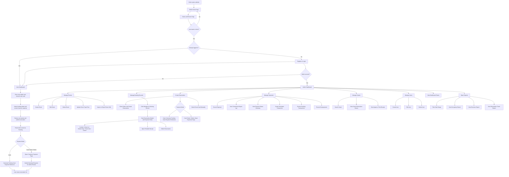
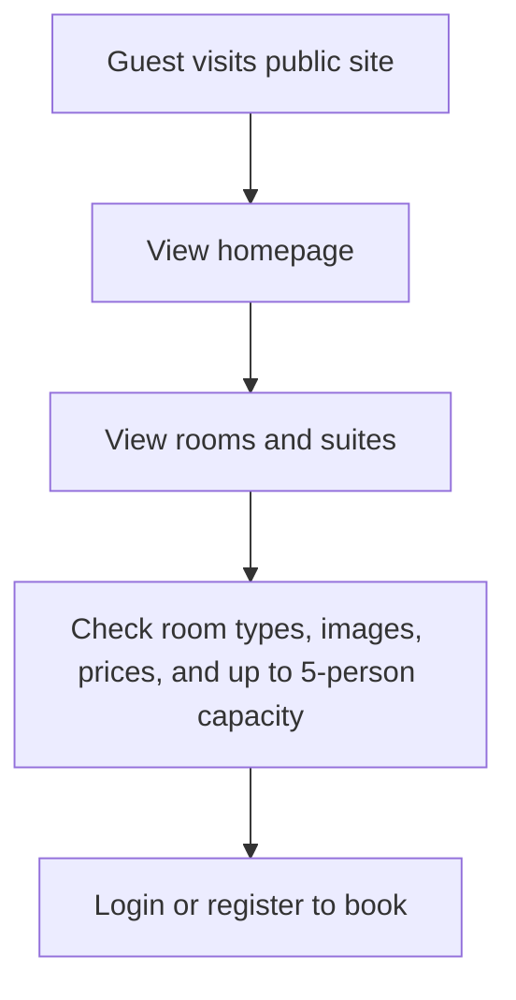
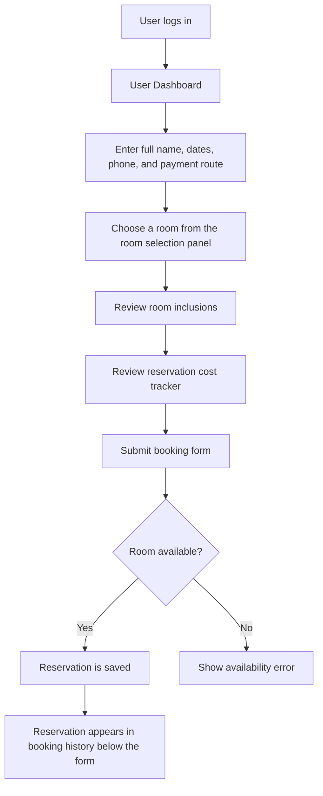

# Website Flowchart

This document shows the main website flow for guests, registered users, and administrators.

## Overall Website Flow

## Guest Flow

## Registered User Flow

## Admin Flow

```mermaid
flowchart TD
    A[Admin logs in] --> B[Admin Dashboard]
    B --> C[View KPI cards and charts]
    B --> C1[Review operational alerts]
    B --> D[Rooms Module]
    B --> E[Reservations Module]
    B --> E10[Booking Records Module]
    B --> F[Payments Module]
    B --> G[Guests Module]
    B --> H[Users Module]
    B --> I[Reports Module]

    D --> D1[Add or edit rooms]
    D --> D2[Delete rooms]
    D --> D3[Bulk update room prices]
    D --> D4[Import or export room XML]

    E --> E1[Check date-aware room availability]
    E --> E2[Add reservation]
    E10 --> E3[Click Manage on booking record]
    E3 --> E4[View reservation details and payment totals]
    E4 --> E5[Confirm, check in, extend stay, check out, or cancel]
    E4 --> E6[Open printable receipt]
    E4 --> E9[Delete reservation]
    E --> E7[Select room card manually]

    F --> F1[Record payment or simulated transaction]
    F --> F2[Review payment history]
    F --> F3[Update transaction status]
    F --> F4[Prevent pending/confirmed overpayment]

    G --> G1[Search guests]
    G --> G2[View guest history]
    G --> G3[Book again or open receipt]

    H --> H1[Add user]
    H --> H2[Edit user]
    H --> H3[Delete user]

    I --> I1[Filter report date range]
    I --> I2[Review occupancy by room type]
    I --> I3[Review revenue by room type or payment method]
    I --> I4[Review daily reservation trends]
```

## Page Route Summary

| Page | Route | Main User |
| --- | --- | --- |
| Home | `public/site/home.php` | Guest, user, admin |
| Rooms | `public/site/rooms.php` | Guest, user, admin |
| Login | `public/auth/login.php` | Guest |
| Register | `public/auth/register.php` | Guest |
| Logout | `public/auth/logout.php` | Logged-in users |
| User Dashboard | `public/user/dashboard.php` | Registered user |
| User Payment | `public/user/payment.php` | Registered user |
| Admin Dashboard | `public/admin/dashboard.php` | Admin |
| Admin Rooms | `public/admin/rooms.php` | Admin |
| Admin Reservations | `public/admin/reservations.php` | Admin |
| Admin Booking Records | `public/admin/booking-records.php` | Admin |
| Admin Payments | `public/admin/payments.php` | Admin |
| Admin Guests | `public/admin/guests.php` | Admin |
| Admin Receipt | `public/admin/receipt.php` | Admin |
| Admin Reports | `public/admin/reports.php` | Admin |
| Admin Users | `public/admin/users.php` | Admin |
